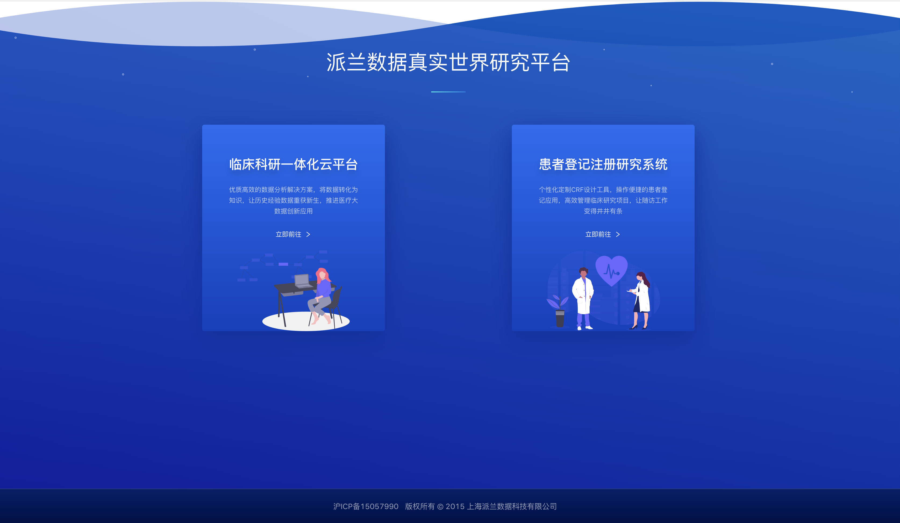

# 概述

## 简介

派兰数据真实世界研究平台为医疗机构， 学术机构提供数据采集、数据存储、质量修复，数据建模、 数据分析、数据可视化、机器学习和人工智能服务全系列SaaS服务， 协助客户进行大数据产品建设.

## 产品特点

* 数据采集与整合

* 数据质量与安全

* 数据库最大利用

* 海量数据秒级处理

* 多种数据分析工具

* 多重安全可靠保证

* 项目管理团队协作

