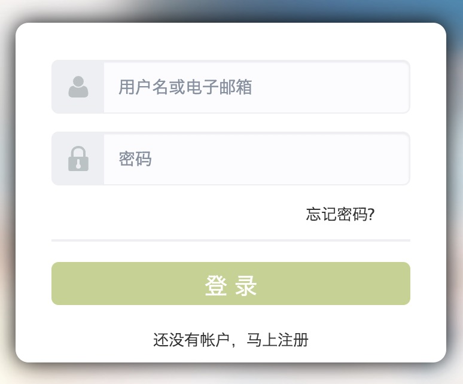
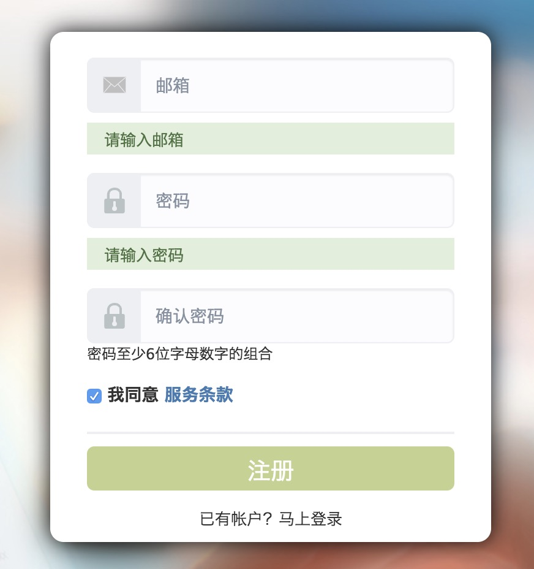
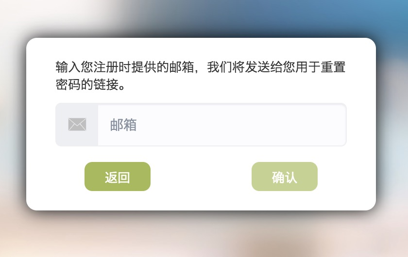
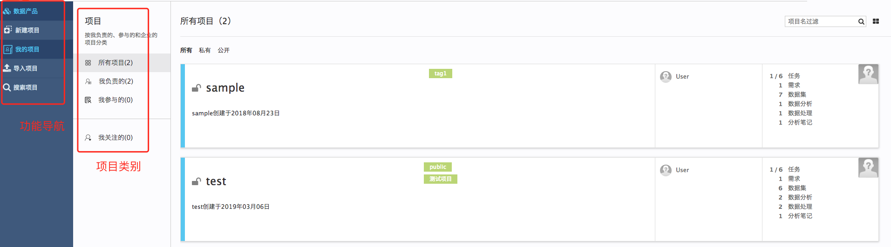
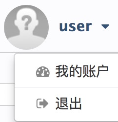
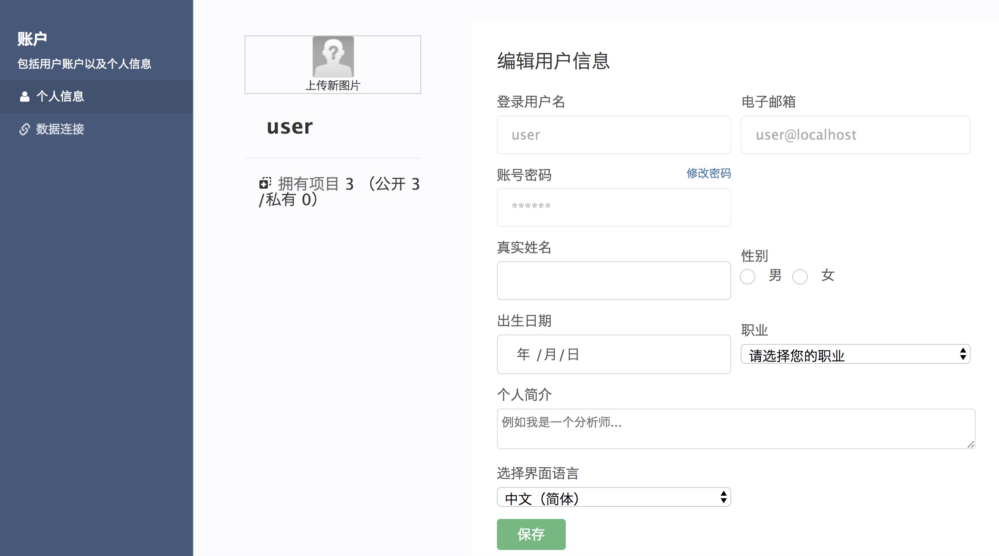
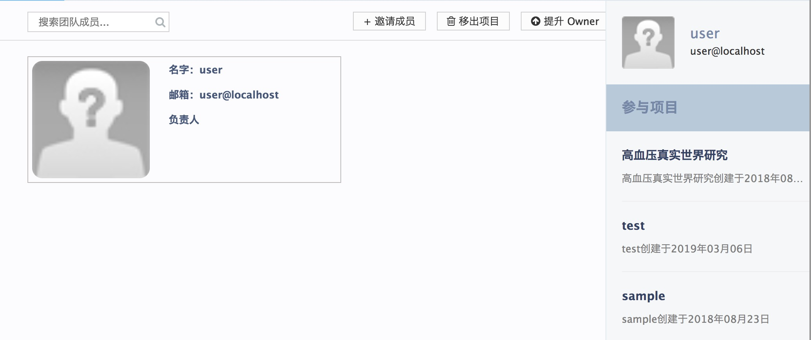

# 帐户

## 登录

### 注册

点击**还没有帐户，马上注册**

- 填写邮箱作为注册帐户。目前仅接受以邮箱注册，此邮箱将作为验证和重置密码时使用。

- 填写帐户密码，密码要求：至少6位数字字母的组合 。

- 确认密码，完成注册。

- 完成注册后注册使用邮箱会收到系统自动发送的确认邮件，点击邮件链接确认完成注册。(如果遇上点击链接无法激活时，复制该链接到浏览器进行激活)

- 激活邮件，设置**用户名**，激活成功。

### 忘记密码

- 点击**忘记密码**

- 输入注册时使用的邮箱，系统将发送密码重置邮件，点击邮件链接进入网站重置密码。

### 首页

激活成功后，系统自动返回登录界面，输入设置的用户名（或者注册时使用的邮箱）和密码，即可完成登录
登录后您会看到如下界面，用户拥有的项目会按照我负责的、参与的和企业项目分类

### 修改个人信息和退出

- 单击红框内的**头像或者用户名**弹出下图

- 单击**我的账户**，进入个人信息编辑界面

- 单击**退出**，退出当前登录账号

## 团队

### 团队成员

数据分析工作通常是由项目团队协作完成的，团队是以项目为基本单位进行形成的，项目成员的一般构成有：

- 项目所有者(the owner)，通常是项目的创建人
- 数据科学家(the data scientist)，通常是派兰数据科技的数据科学家
- 普通项目成员 (the team member), 是项目一般参与人
- 项目关注者 (the watcher)，是关注了本项目的人
- 申请加入项目的申请人 (the requester)，是申请想要加入项目的人

### 团队管理

不同项目成员有不同的对成员管理的权限：

* 项目owner（项目创建者）
** 主动邀请新成员的加入，此时需要知道被邀请人员的注册邮箱，向被邀请人员发送一份有加入链接的邀请邮件。被邀请人点击链接以后:
*** 如果没有注册过，则先进行注册，然后将该用户加入到项目中
*** 如果已经注册过，则直接将用户加入到项目中，并引导进入项目的首页
** 将选中的成员移出项目
** 将项目owner转交给选中的成员 **注意：一个项目中只支持一个owner的存在**
** 处理成员的加入该项目的申请
* 普通成员
** 将自己移出项目

权限修改后，需要重新刷新成员头像显示页面。

