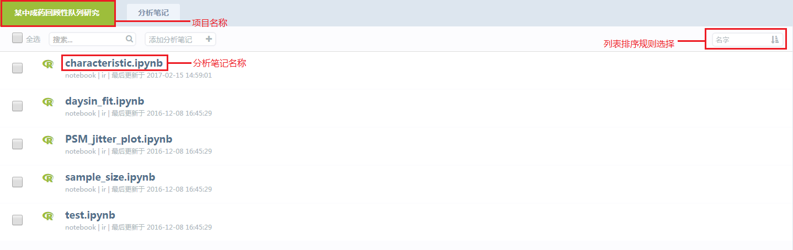
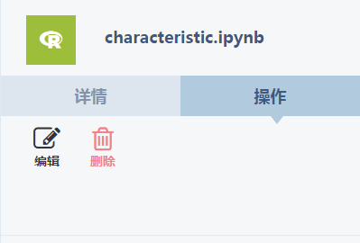
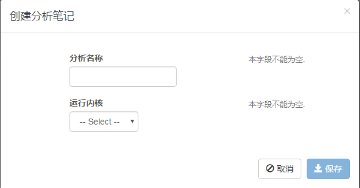
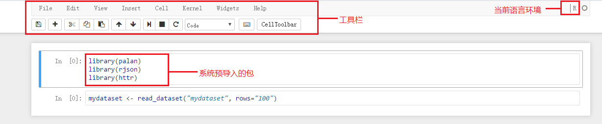
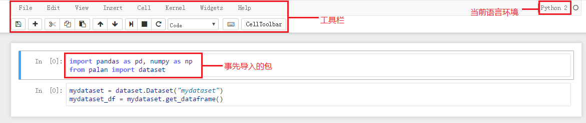
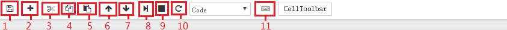
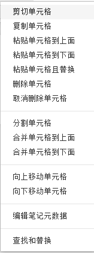

# 分析笔记

`分析笔记配置了R、python2、python3的编译环境，使数据分析工作者也能通过自身编写的代码完成复杂图表的生成和数据处理`

单击**常驻功能导航栏**的**分析笔记**，进入分析笔记列表

* 单击分析笔记名称，进入相应的notebook编译页。

* 单击分析笔记名称以外区域，右侧出现下图，**编辑**——进入notebook编译页，**删除**———删除该分析笔记，同时还可查看详情

* 每个可视化分析过程前的可选框或者上方的“全选框”选中后，也可提供**编辑**和**删除**功能

* 新建项目分析笔记默认为空

## 新建笔记

* 单击分析笔记列表上侧工具栏中的**添加分析笔记**，如下弹出框

* 分析名称：名称不做任何限制，但必须填写

* 运行内核：有R、python2、python3三种内核可供选择，必须进行选择

* 分析名称、运行内核都必须提供，缺一不可，否则该分析笔记将无法创建

* 分析笔记为R内核，单击保存之后，进入如下编译界面，已事先导入了**palan**（公司自己的库）、**rjson**、**httr**三个包

* 分析笔记为python内核，单击保存之后。进入如下编译界面，已事先导入了**palan**（公司自己的库）、**pandas**、**numpy**

## 编译使用介绍

* 工具栏

1. 保存——保存编写好的代码
2. 添加——在选中的代码框下方添加空的代码框，并选中
3. 剪切——剪切选中的代码框内容
4. 复制——复制选中的代码框内容
5. 粘贴——粘贴复制的代码框内容
6. 上移——向上选中代码框
7. 下移——向下选中代码框
8. 运行并下移——运行选中的代码框，并向下选中代码框
9. 停止运行
10. 重新启动——重新启动内核环境
11. 快捷键说明

* 顶部栏

1.**编辑**

2.**查看**

3.**插入**

4.**单元格**

5.**内核**

6.**Widgets**

7.**帮助**

