# 项目

## 创建数据分析项目

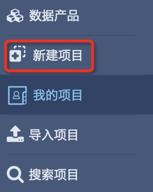
* 登录后进入项目列表页面，选择列表页面左侧功能导航栏，点击**新建项目**

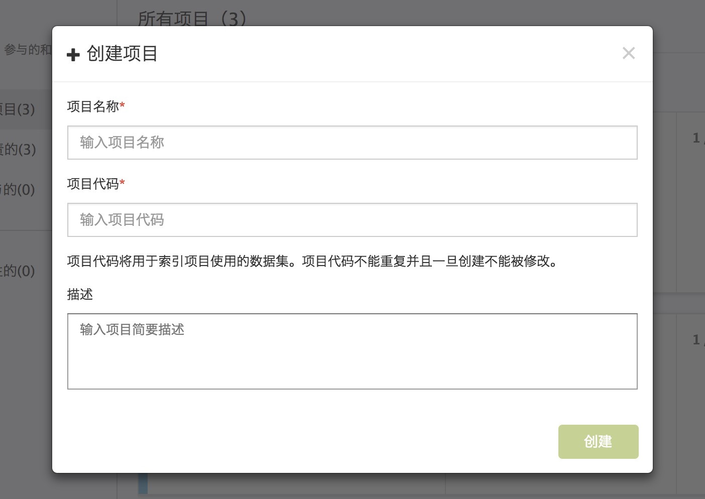
* 在弹出的创建项目页面中输入**项目名称**和**项目代码**，完成项目创建

** 项目名称用于给使用者标识，可为任意字符和汉字。项目建成后，可修改
** 项目代码用于给后台数据库以及项目相关的数据集标识，可为小写字母、数字和下划线。项目建成后，不可修改
** 项目代码随着项目名称的输入可自动生成，在项目创建完成前允许修改
** 项目代码自动生成规则
*** 项目名称输入任意字符时，项目代码只保留小写字母、数字、下划线
*** 项目名称输入汉字时，项目代码保留汉字拼音首字母

## 项目概要

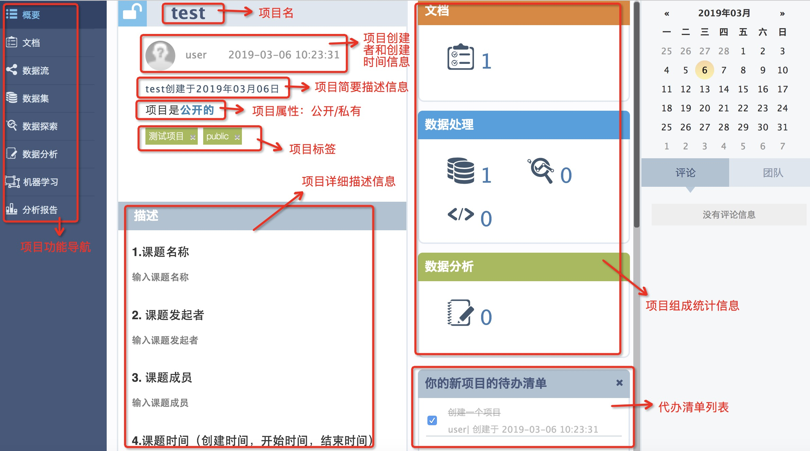
项目概要界面从左到右以功能划分，主要可分为五大部分：

- 常驻功能导航栏
- 概况介绍
- 详细描述
- 各个组件统计
- 评论及团队成员

### 常驻功能导航栏

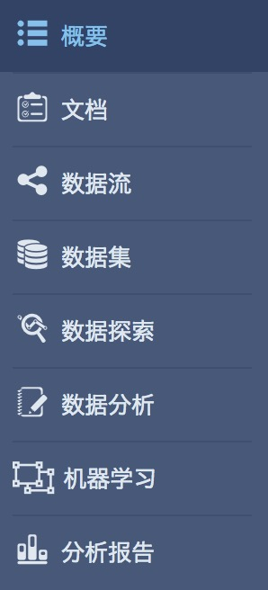

常驻功能导航栏始终位于整个界面的左侧，导航了8个界面，分别为：
- 概要界面：
选择或新建项目后默认进入的页面，里面集中概括了对整个项目的简介信息、描述信息和组件的统计信息

- 文档：
点击之后可看到创建的所有文档的列表。进入文档详情界面，主要包含文档的简介，文档的详细描述和针对该文档的待办信息

- 数据流：
由不同类型的图标和有向线段连接而成，不同图标在数据处理中代表不同的含义。在这里，用户可以清楚地看到数据分析中的数据的流向，简单直观

- 数据集界面：

点击之后，可看到所有数据集列表。用户可以通过选择具体数据集来查看其具体内容，也可以通过**构建**重新从数据源读取数据集

- 数据探索：

数据探索功能支持分步添加数据处理方法如数据查找、替换、删除、计数等，保留了数据集处理过程。

- 数据分析：

支持用户自己编写代码进行数据处理，支持在线即时运行并生成运行结果，目前平台支持R语言、Python2、Python3

- 机器学习：

支持随机森林、逻辑回归、决策树等多种机器学习算法，可自定义训练参数。

- 分析报告

通过添加文字，图片，图表等形式整理分析结果，形成分析报告。

### 项目概要介绍

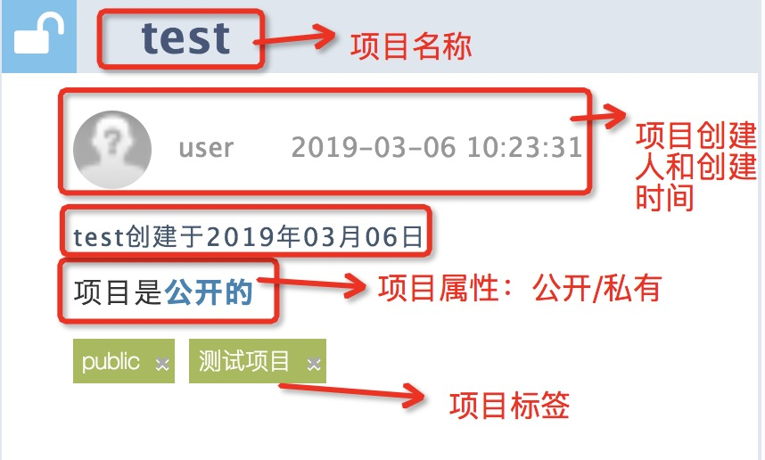
从上到下分成五行

第一行：项目名称

- 点击项目名称，可以编辑

第二行：创建人头像、昵称和创建时间

第三行：项目简介，在快速搜索项目的过程中，也可将该简介作为搜索项

- 点击，可以编辑

第四行：项目标签，在快速搜索，也支持标签搜索

- 点击项目属性可以切换项目属性

第五行：项目标签，在快速搜索，也支持标签搜索

- 点击，可对标签进行增、删、改

### 详细描述

- 默认如下图

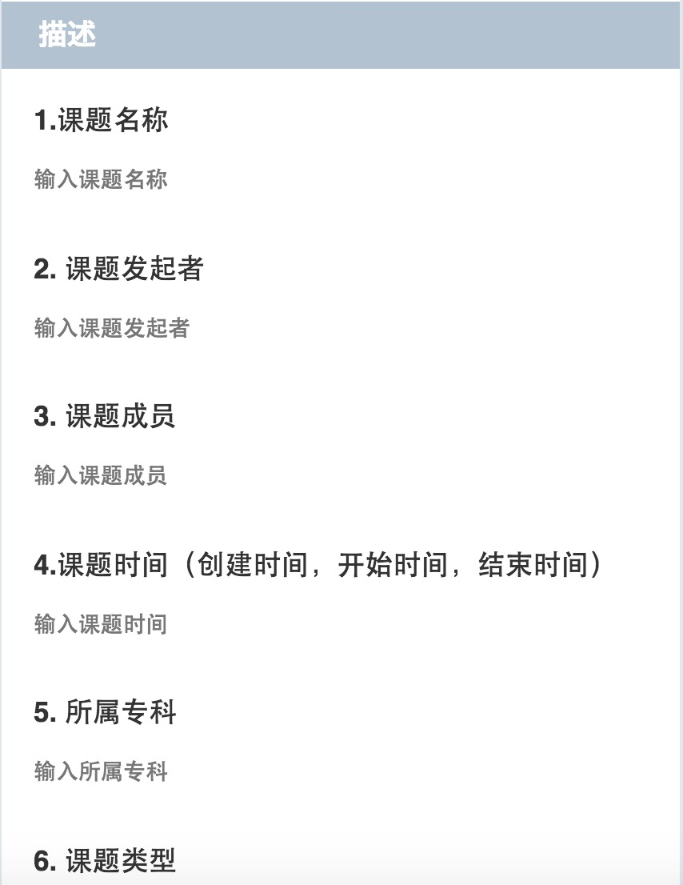

- 点击后进入如下界面，使用markdown进行编辑,提供了markdown常用的格式按钮

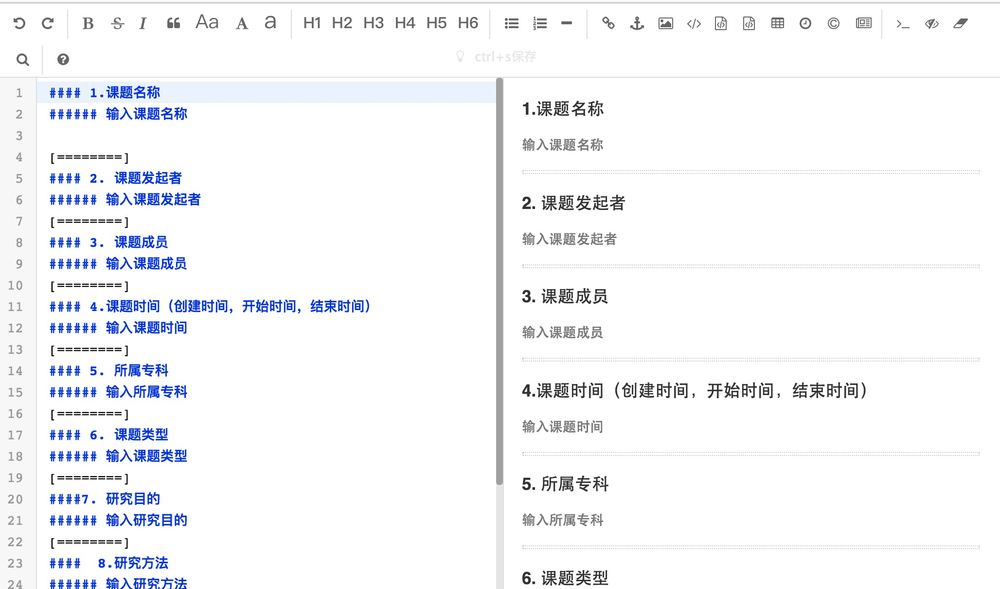

### 各个组件统计

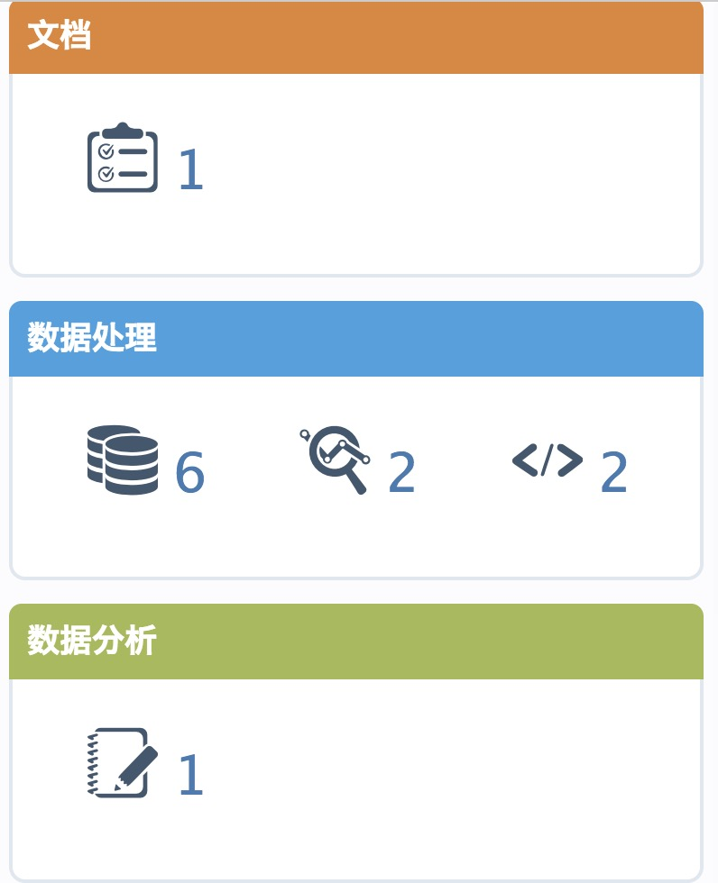

每个图标代表特定含义，图标后的数字是代表该含义的统计数字，单击图标可进入对应的列表页面

- 文档图标

- 数据集图标

- 数据探索图标

- 数据处理图标

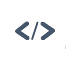

- 分析笔记图标

- 待办事项清单列表

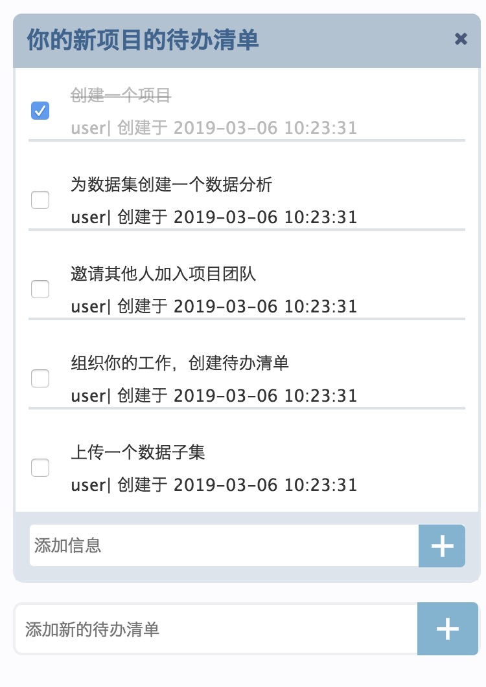
单击文字部分，可以进行编辑

小方框自主勾选，指示待办事项是否完成

添加新的待办事项

### 评论及团队成员

位于概要页面的右栏

- 右栏上半部分：提供了类似日历的功能，可进行评论日期的选择(有评论的日期以灰色为背景)

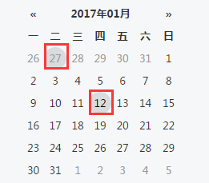

- 右栏下半部分，以页签的形式显示评论信息和团队成员信息

评论页签：根据选择的日期，在该页签中显示该日期的评论

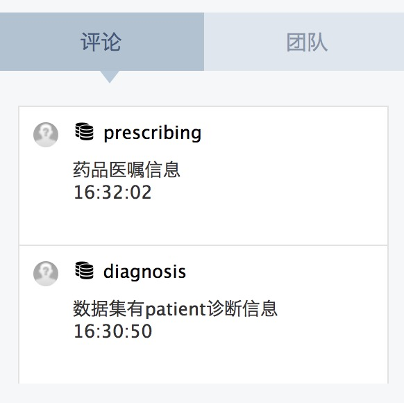

团队页签：显示团队全部成员，每个成员的头像、昵称和加入当前项目的时间

