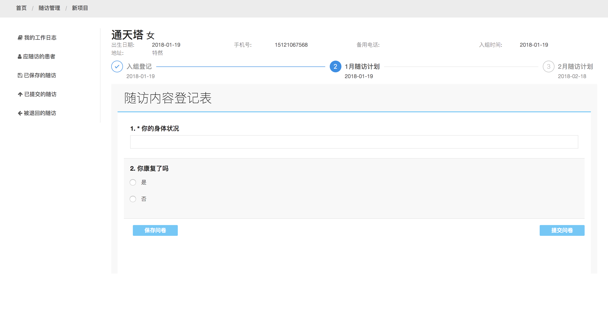
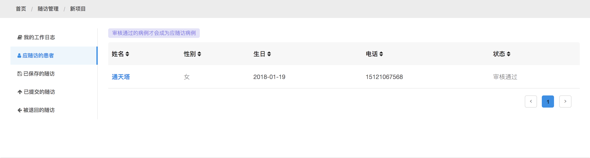
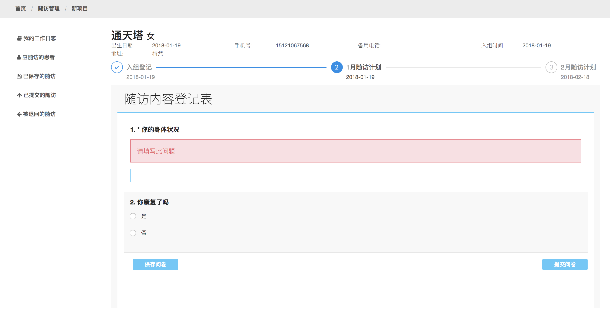
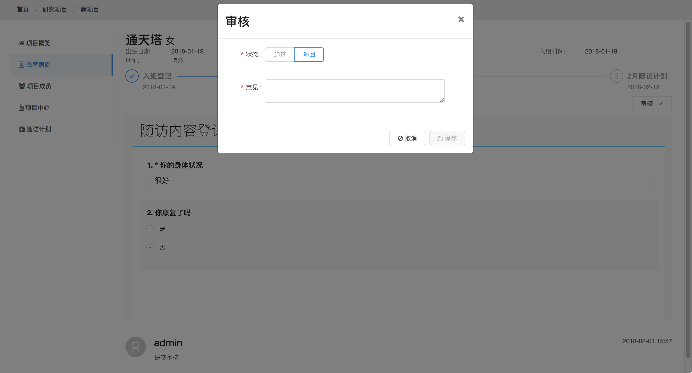
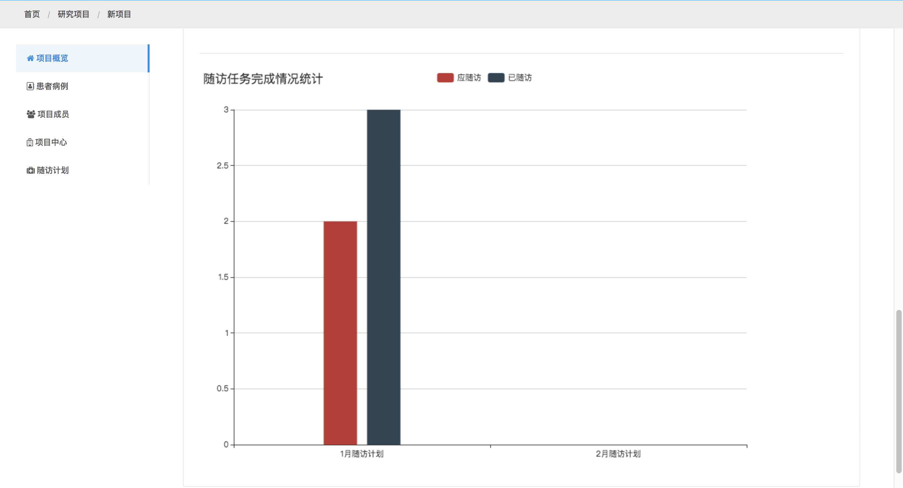

## 为多次的随访任务分配不同的病例表

同一个患者在不同阶段，随访的内容可能有所不同，系统能够为不同阶段的随访分配不同的病例表以满足研究的需要

## 随访任务的自动分配

系统自动会将符合随访规则的患者清单筛选出来，并分配给随访小组的成员，这个清单在不断地更新，而各成员依据分配的任务开展工作，并提交汇总数据

## 数据的质量控制及审查

应用系统会基于一定的规则对于录入的数据进行判断并给予输入者提示，要求检查所录入数据项的正确性。

同时，应用系统也设置了人工审查的选项，即数据录入者提供的数据信息必须经过一位有资格的管理员进行最后的审查批准才能正式生效

## 实时的工作进度汇总数据

无论是新增加的患者随访记录的数字，还是已经提交正在等待审查的记录的数字，工作进度的汇总数据实时显示，让录入人员，以及项目的管理员能够及时把控随访工作的进度

