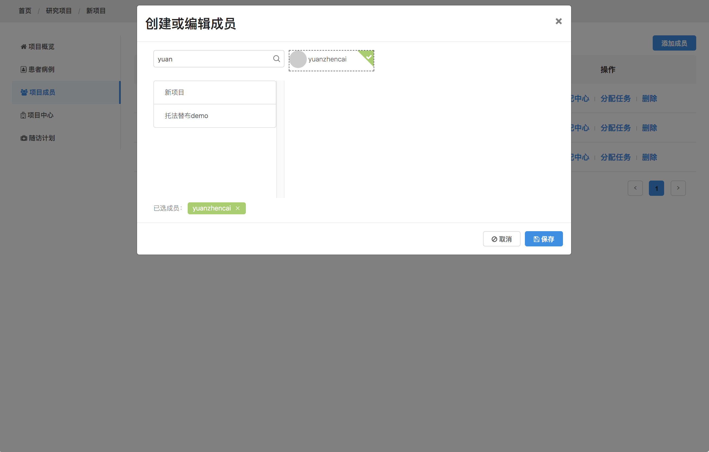
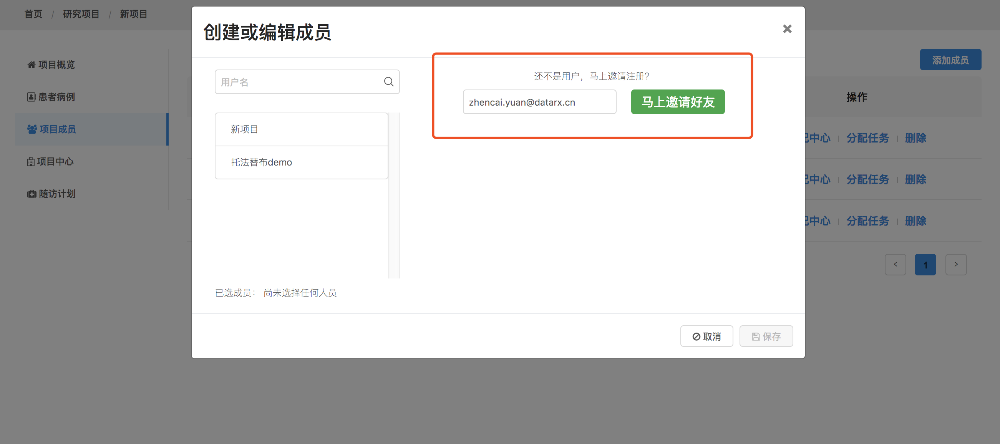
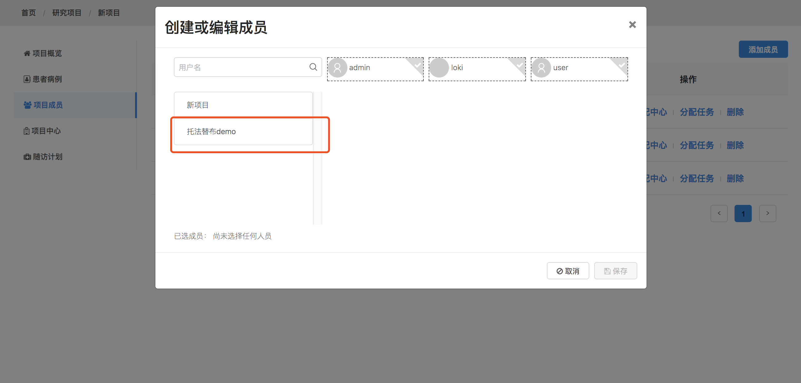
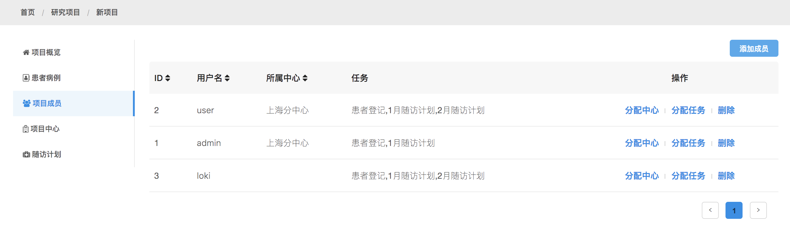
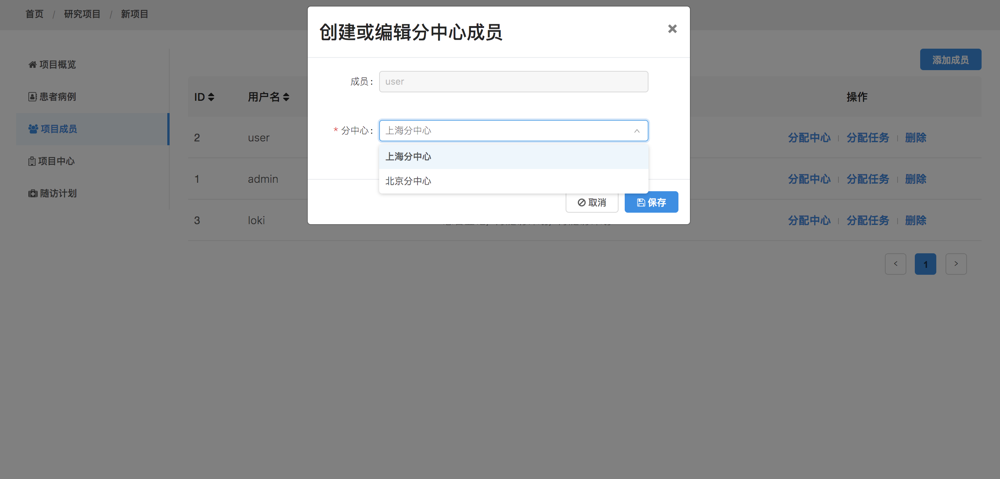
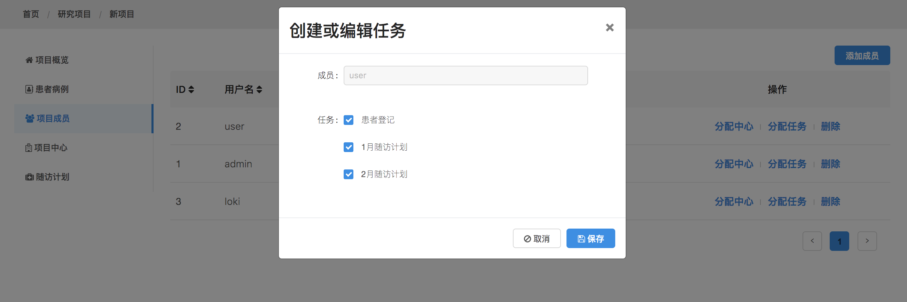

## 项目成员的管理

无论是一个人或是多人间的团队协作，都能满足要求。团队成员可以分布在不同的地点，利用互联网基于同一个数据库开展工作，添加、修改、更新并汇总患者的首次登记信息或者是随访信息

* 添加成员

我们可以通过用户名搜索来添加成员

如果用户不存在，只需要一个邮件就可以邀请到系统里，然后等用户激活后自动就加入到项目中

还可以添加你参加的其他项目的成员

* 成员列表

* 分配中心

* 分配任务

