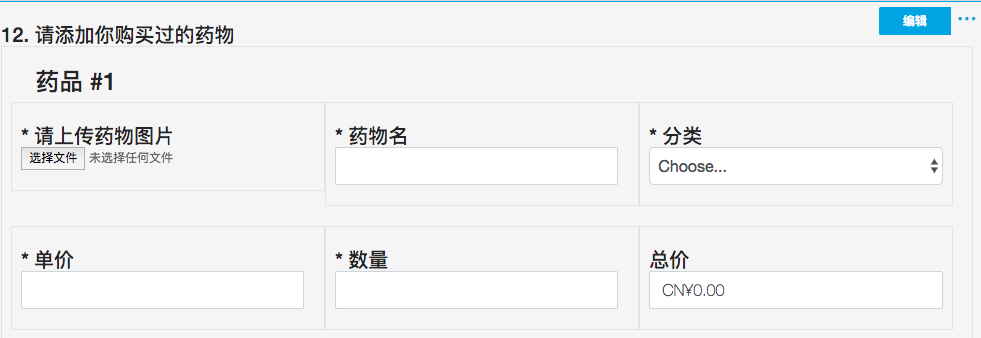
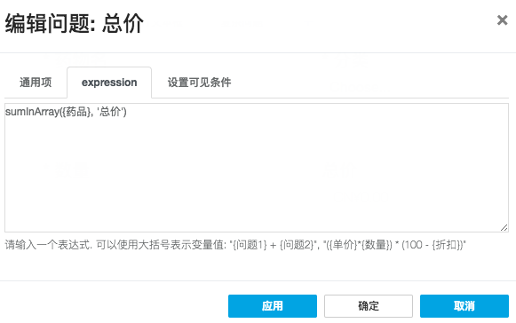
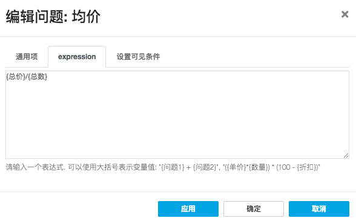

## 高级用法

比如有个复杂的问题叫，请添加你购买过的药物

这个问题中涉及到动态情况，因为你可以能有买过药物，也有可能没有。

要添加药品图片、单价、数量，但是还要总价，也就是单价 * 数量

所以就要用到 文本框 、 文件 、 动态面板 、 表达式等组件。

接下来我们就来设计一下这个问题。

1. 首先是动态，然后因为为了好看我们还想稍微要排版下问题，所以我们选择"动态面板"组件

    设置面板的基本属性，比如添加面板的按钮名称和删除面板的按钮名称
    
    
    
    有时候我们想要知道到底添加了多少个商品的时候，就可以设置一个面板名称，比如 药品 1、药品 2，那我们就可以用到动态面板里内置的参数*panelIndex*，然后通过`{panelIndex}`调用。
    
    所以我们就可以这样设置面板标题
    
    ```
    药品 #{panelIndex}
    ```
    
    

2. 添加药品问题，然后通过是否新起一行来控制页面布局
    
    
    
3. 最关键的是计算，因为我们要为每填加一条数据就要计算总价，所以我们要用到表达式组件，由于我们是动态面板，所以我们要用到内置的例外一个参数*panel*,然后通过`{panel.问题}`来得到每条记录里问题的值

    所以要设置总价的表达式的值为
    
    ```
    {panel.单价}*{panel.数量}
    ```
    
    
    
    有时候我们还需要单位，我们就可以设置显示样式和货币类型
    
    

4. 有时候我们可能还要对某个动态问题做个汇总，比如求和，求平均，就像药品的总数、总价、均价

    那我们就要用到表达式里非常有用的内置函数*sumInArray({问题},'属性')*。
    
    然后我们这次就要算下所有药品的总价和药品的总数
    
    先利用面板组件添加三个表达式组件，分别是总数，总价，均价
    
    
    
    然后要设置总数的表达式
    
    ```
    sumInArray({药品}, '数量')
    ```
    
    

    总价也是类似
    
    ```
    sumInArray({药品}, '总价')
    ```

    
    
    最后是均价，这个就比较简单，就是问题总价的值除以问题总数的值
    
    ```
    {总价}/{总数}
    ```
    
    


最后的效果


