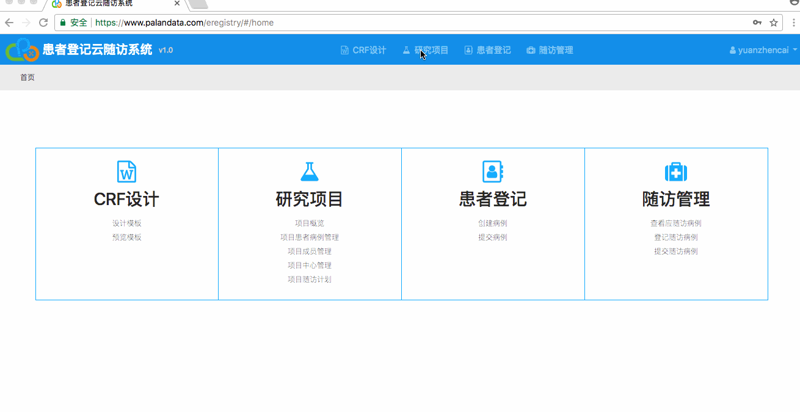
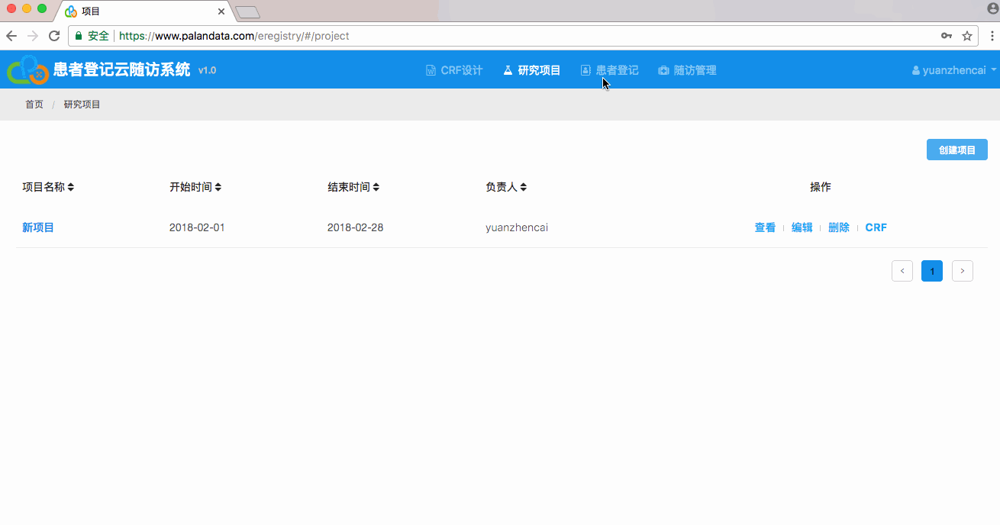
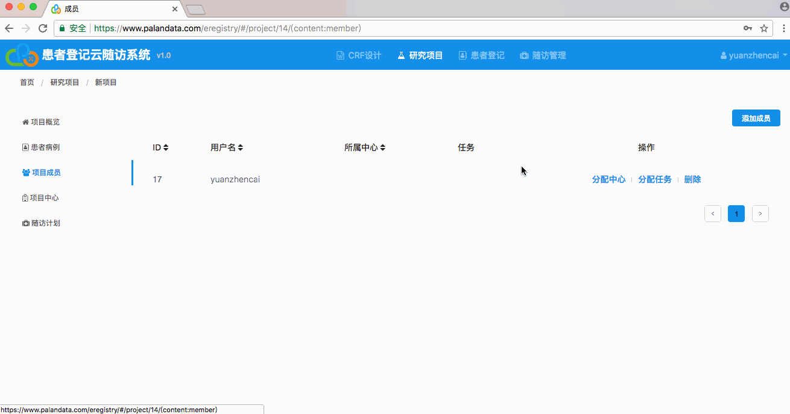
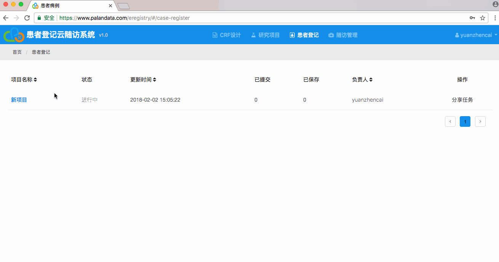
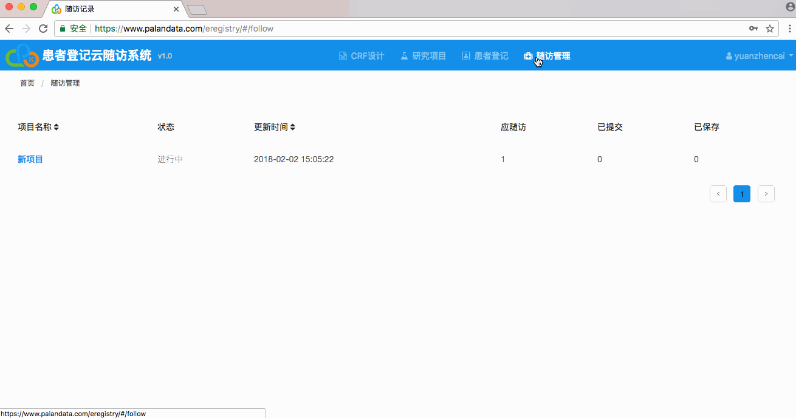

## 快速入门

### 第一步：创建项目

1. 进入研究项目菜单
2. 点击创建项目
3. 然后填写项目信息后点击保存。

### 第二步：创建计划

1. 进入项目详情
2. 点击随访计划侧边栏
3. 点击创建随访计划
4. 填写计划信息后点击保存

### 第三步：分配任务

1. 点击项目成员侧边栏
2. 选择需要分配任务的成员
3. 点击分配任务
4. 勾选任务后保存

### 第四步：登记病例

1. 点击患者登记菜单
2. 进入你所需要登记病例的项目
3. 点击创建病例
4. 填写病例信息后提交

### 第五步：进行随访

1. 点击随访管理菜单
2. 进入你所需要随访病例的项目
3. 点击应随访侧边栏
4. 查看需要随访的病例信息
5. 录入需要随访内后提交

