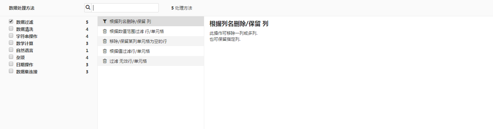
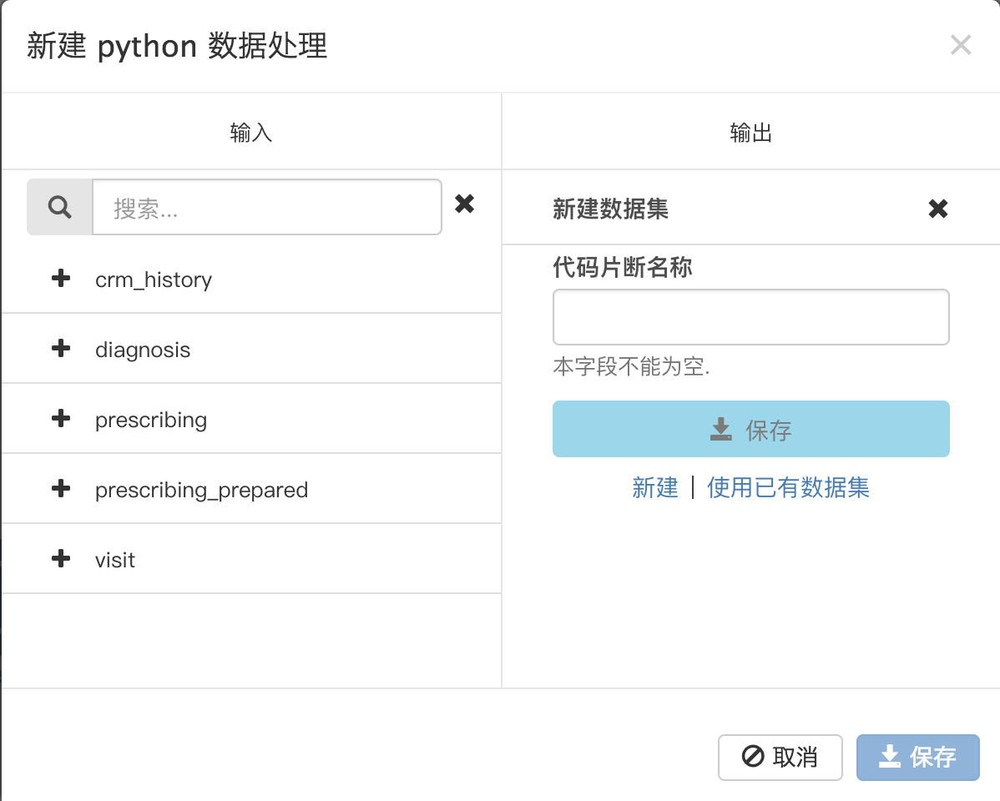

# 数据分析
项目建成后，数据处理的介绍全部依托于平台左侧的**常驻功能导航栏**

## 项目文档

点击左侧**常驻功能导航栏**的**文档**即可进入项目文档列表页，新建项目需求默认为空

### 新建项目文档

新文档建立完成后，以列表形式出现，结果如下：

* 单击文档名称，默认进入文档详情界面，该界面分为“概要”、“编辑”、“附件”三个子界面

** 概要界面

简要描述区：inline方式进行编辑

标签添加和管理：以磁贴方式对标签进行管理，支持inline方式编辑

研究需求：需求的详细介绍，单击后可见如详细介绍编辑页面，编辑页面接受Markdown编辑

待办清单列表：添加需要待办清单，为使用者使用提供方便，使数据分析目的性更强，有利于团队协作。支持inline方式编辑

评论区：添加对新增需求的评论

附件区：上传的附件信息，删除的附件不再出现

** 编辑界面

用于研究需求的编辑，支持Markdown

** 附件界面

上传有关项目需求的附件。上传的附件以列表形式出现

上传完成后，附件以列表形式出现，单击附件名即可进行下载

* 单击附件名称以外的区域，默认出现下图

1.操作

**编辑**——进入需求概要界面，**上传附件**——进入附件界面，**删除**——删除该条需求

2.评论

显示对需求的评论信息，按照评论时间的早晚从上到下排列

3.详情

显示了需求创建时间、更新时间、`附件——目前没显示附件信息`、需求简要描述、需求详细描述

## 数据处理
在平台上可在线自由创建数据集，并且提供了两种类型的数据分析方法：

1.可视化数据处理

将基本的20种数据处理方法进行可视化处理，例如查找替换、转换字符串等。只要选定数据分析方法和操作区域，平台就自动生成处理代码，完成数据处理。
告别了枯燥费时的代码编写过程，使数据处理更加方便快捷。

2.代码片段数据处理

当然平台也提供了手动编写代码进行数据处理的编译环境，为更加复杂的数据处理过程提供可能

我们相信，将可视化与代码片段结合，一定能使数据处理达到让使用者满意的效果。

### 数据集

单击**常驻功能导航栏**的**数据集**，进入数据集列表

- 单击数据集名称，进入相应数据集信息页。数据集信息页有**概要**、**浏览**、**图表**、**设置**四个子页面，默认进入**浏览**子页面

- 单击数据集的名称外区域，右侧出现下图,**浏览**——进入数据集浏览界面，**删除**——删除该数据集，同时还可查看详情和评论。下侧Python、R 两个图标均可进行点击构建相应的代码片段

- 每个项目前的可选框或上方的“全选框”选中后，也可提供**浏览**和**删除**的功能，还可直接添加或删除标签

- 新建项目数据集默认为空

#### 数据集分类

- 上传的数据集

- 利用平台数据处理产生的数据集

#### 上传数据集

* 单击**添加数据集**，弹出**上传文件**按钮，单击后进入**新建上传文件的数据子集**界面

1. 数据集名称必须自行输入，仅支持小写字母、数字和下划线，不允许重名

2. `目前数据文件类型仅支持csv和execle格式`

* 上传数据文件完成后，系统会自动跳到**新建上传文件的数据子集**的预览界面，如上图

** 预览区域：不提供所有数据预览，只能预览建成数据集的前100行

** 表头选择

*** 无表头：数据集第一行索引列名是系统默认按规则生成col_0、col_1、col_2、col_3……，数据集第二行是数据文件所有的列名。

*** 有表头：数据集第一行索引列名就是数据文件的列名

* **新上传文件的数据子集**的列信息界面

—— 可手动修改列名，别名，在平台上的显示类型

—— 一行代表在数据集中一列的信息。选中某一行后，页面右侧弹出小页签，分别可为其添加描述，了解该列数据类型信息和该列数据数据的json格式

* 点击**保存**之后，默认进入刚刚创建的数据集信息页的浏览界面

#### 数据集概要界面

数据集概要界面包括数据集名称、数据集管理、标签管理、数据集详细描述、待办清单列表、评论区

* 数据集名称：inline方式进行编辑

* 数据集简介：inline方式进行编辑

* 标签管理：以磁贴方式对标签进行管理，支持inline方式编辑

* 数据集详细描述信息：数据集的详细介绍，inline方式编辑

* 待办清单列表：添加需要待办清单，为使用者使用提供方便，使数据分析目的性更强，有利于团队协作。支持inline方式编辑

* 评论区：添加评论

#### 数据集浏览界面

* 点击左侧功能键，进入样本数据设置

样本数据抽取方式有三种：

1 最先记录

从数据集中抽样最前的N条记录. 这是一种最快的抽样方式但抽样的数据可能有很大的偏差.N由**目标记录个数**确定

2 记录数固定（随机抽样）

这种方式从数据集中随机的抽取N条记录. 这是最慢的一种抽样方法但是最能表现数据集中数据的分布情况.N由**目标记录个数**确定

3 固定比例（随机抽样）

从数据集中随机地抽样 N% 的记录数, 如果输入一个太大的比例将会得到一个过分庞大的样本数据集而带来内存限制的问题.N由**抽样百分比**确定

* 详细数据实时浏览区域

** 首行显示数据列的索引列名 (在导入数据预览时,选择`有表头`，则可将源数据的列名作为数据集的索引列名，否则数据集列名则为系统默认值)
** 第二行显示数据列的存储类型
** 第三行显示数据列在平台上的显示类型，可单击修改显示类型(显示数据类型与图表的y坐标息息相关)
** 第四行及以后显示数据信息

单击**列名** ——下拉菜单显示**分析**、**过滤**、**排序**等一些对列操作的基本功能

单击**过滤**——选中该列的某些值过滤后，实时浏览区域就只显示包含上述值的整行数据

禁用按钮：禁止该条件的过滤

筛选条件：支持多条件筛选

单击**分析**——分析当前列的统计信息

单击**排序**——升序或者降序

单击**类型** ——修改该列的显示类型(显示数据类型与图表的坐标息息相关)

* 所有列的统计信息按钮

#### 数据集图表界面

* 索引列名

** 值类型为number（包括integer、float、double类型）的索引列名前,以**#**标志
** 除number类型外，其他值类型的索引列名前，以**A**标志
** 无需添加会出现名为`Count of records`的number类型索引列，该列表示坐标系中对应x值存在的个数

* 图表样式选择

单击**图表样式选择**按钮，即可看到上图

* 柱状图：

可选择一个或者多个维度，一个或者多个度量

* 折线图：

可选择一个或者多个维度，一个或者多个度量

* 饼图

可选择一个维度，一个度量

#### 数据集状态界面

显示数据集所有列的示例信息

#### 设置界面

可以修改数据的配置，预览后重新刷新数据

### 可视化数据探索

单击**常驻功能导航栏**的**数据探索**，进入可视化数据分析列表

* 单击可视化数据分析名称，进入相应的可视化数据分析信息页。可视化数据分析信息页有**概要**、**脚本**、**图表**三个子页面，默认进入**脚本**子页面

* 单击可视化数据分析名称以外区域，右侧出现下图，**编辑**——进入脚本子页面，**删除**———删除该可视化数据分析，同时还可查看详情和评论

* 每个可视化分析过程前的可选框或者上方的“全选框”选中后，也可提供**编辑**和**删除**等功能，还可添加或删除标签

* 新建项目可视化数据分析列表默认为空

#### 新建可视化分析

* 单击可视化分析列表上侧工具栏中的**添加可视化分析**，如下弹出框

* 在弹出框中选择已经存在于平台的数据集作为可视化分析的对象,每次只能选择一个数据集
* 可视化数据分析名称，系统默认为“Analyze”+空格+数据集名称，也可以自行修改。`此处名称不作任何限制（待修改）`

#### 可视化概要界面

* 可视化数据处理名称：inline方式进行编辑

* 可视化数据处理简介：inline方式进行编辑

* 标签管理：以磁贴方式对标签进行管理，支持inline方式编辑

* 可视化数据处理详细描述：inline方式进行编辑

* 待办清单列表：添加需要待办清单，为使用者使用提供方便，使数据分析目的性更强，有利于团队协作。支持inline方式编辑

* 评论区：添加评论

#### 可视化脚本界面

* 左侧列表栏

** 设计样本：同数据集的[样本设置](#sample-settings)，这里不再重复介绍

** 脚本：使用的数据处理方法和对象列表。点击绿色按钮**添加数据处理方法**在页面下方弹出下图，集成了22种常见数据处理方法

该弹出页面分成左中右三栏：

左栏：数据处理方法大类显示，分为**数据过滤**、**数据清洗**、**字符串操作**、**数学计算**、**自然语言**、**日期操作**、**数据集连接**、**杂项**八大类

中栏：22种数据处理方法名称介绍，并可根据左栏大类的勾选相应显示该类的数据处理方法，大致分类如下

1. 数据过滤

    * 根据列名删除/保留列
    * 根据数值范围过滤行/单元格
    * 移除/保留某列单元格为空的行
    * 根据值过滤行/单元格
    * 过滤无效行/单元格

2. 数据清洗

    * 反转布尔值
    * 移除/保留某列单元格为空的行
    * 用固定值填充空单元格
    * 过滤无效行、单元格

3. 字符串操作

    * 查找和替换
    * 转换字符串
    * 计数(统计某列的数据单元格中与指定字符串匹配的个数)
    * 拆分列

4. 数学计算

    * 根据数值范围过滤行/单元格
    * x的平方取整数
    * 生成数值组合

5. 自然语言

    * 计数(统计某列的数据单元格中与指定字符串匹配的个数)

6. 日期操作

    * 计算日期差
    * 解析为标准时间格式
    * 提取日期

7. 数据集连接

    * 连接其他数据子集
    * 连接(差集)其他数据子集
    * 连接(Union)其他数据子集

8. 杂项

    * 复制列
    * 列重命名
    * 连接列

右栏：通过鼠标在中栏的聚焦，右栏可对应显示该方法的详细介绍

单击中栏的数据处理方法，就会在左侧列表栏的脚本小界面中，以列表形式出现，输入数据处理的对象，以回车键完成，即可在数据集显示区显示结果。如下图：

禁用按钮：在不删除当前方法的前提下，使该方法不作用于当前数据集

删除按钮：删除当前方法

评论按钮：评论当前方法

克隆按钮：克隆当前方法和被处理的对象，从而形成与当前完全一致的数据处理方法

* 左侧功能键：弹出和隐藏左侧列表栏

* 数据集显示区

实时显示处理进行相关数据处理后的数据集，可以达到边处理便预览的实时效果
** 第一行显示数据集的索引列名
** 第二行显示该列的显示类型，可单击修改显示类型(显示数据类型与图表的y坐标息息相关)
** 第三行及以后显示数据信息
** 单击索引列列名

单击**删除**，相当于在左侧列表栏的脚本页面添加一个删除的数据处理方法
单击**重命名**，重命名该列索引列名
单击**过滤**——选中该列的某些值过滤后，实时浏览区域就只显示包含上述值的整行数据

禁用按钮：禁止该条件的过滤

筛选条件：支持多条件筛选

** 单击数据的单元格

蓝色部分内容为单元格里的具体内容

* 选择可显示列

* 列统计信息按钮, 快速查看列信息

#### 可视化图表界面

与数据集图表界面类似，故在此不做过多叙述

#### 部署脚本

部署脚本按钮相当于将之前的可视化数据处理过程变成代码，并且产生输出数据集。由于代码具有可重复利用性，所以一次部署，可以多次使用

* 单击**部署脚本**，出现下图

输入数据集：默认为可视化数据处理时导入的数据集

输出数据集可有两种选择：

** 新建数据集

*** 新建时，数据集会自动填充，默认为输入数据集名+下划线+"prepared“

*** 也可自行修改。修改时需注意输出数据集名称是英文、数字或下划线的任意组合，但是名称第一位必须为英文

** 使用已有数据集

使用已有数据集时，系统提供选择，无需进行名称的输入。`注意：此时已有的输出数据集最好为空数据集，否则原有数据将会被覆盖`

** 部署了之后会自动跳到数据流代码片段的代码子页面,该页面提供输出数据集的预览和运行

未运行前，**数据流**的流向图中，会以有向图片方式形象描绘出数据流向，且在**数据集**功能中也会出现该输出数据集，但是该输出数据集内容为空或者无变化

点击运行之后，输出数据集会出现经过可视化数据处理后的数据集

#### 操作

浏览数据集：页面跳回到**数据集功能**的浏览界面，可浏览输入数据集的原始数据

删除：删除整个可视化数据处理，并将该分析从可视化数据处理列表中删除，对已经部署好的脚本无影响

## 数据流

数据流功能实质为数据流向图功能。利用各种图标和有向线段，形象地展现数据的来源和流向。

### 数据流界面

单击**常驻功能栏**的**数据流**，进入数据流界面

#### 图标

图标分为两类：数据集图标、处理过程代码片段图标

数据集图标：

利用平台数据处理产生的数据集

处理过程图标：

处理过程为可视化数据处理

处理过程为R语言的代码片段

处理过程为python语言的代码片段

#### 单击图标

* 单击数据集图标，右侧界面如图

**浏览**——进入浏览界面，**删除**——删除选中的数据集，同时提供详情和评论

* 单击处理过程代码片段图标，右侧界面如图

**编辑**——进入数据流代码片段的代码子界面，**运行**——运行该代码片段，进入数据流任务界面的概要子界面，**删除**——删除该代码片段，同时还可查看详情和评论

#### 添加数据集

详见数据集的上传数据集部分

#### 新建代码片段

* 单击**新建代码片段**，在弹出框中选择代码片段构建的语言(语言包括R、Python、Hive，选择后即可进入相应语言的编译环境），确定好输入输出数据集,单击保存,即可进入代码片段界面的代码子界面

* 确定输入输出集

单击左右侧的**添加**后，出现下图

左界面：确定输入数据集，点击**添加**后，在下拉框中选择

右界面：
** 确定输出数据集，点击**添加**后，默认为**新建**，需要手动输入输出数据集名称(名称只支持小写英文字母、数字和下划线的组合，且首位必须为小写英文字母)，完成名称输入后必须点击**保存**，否则将无法创建；
** 若已存在的数据集，也可点击**使用已有数据集**后在下拉框中选择
** **保存**之后，进入代码片段的代码子页面，系统默认生成创建源码。其中palan是公司自己分装的库，会在以后提供说明文档。在源码基础上可自行利用代码进行数据处理

### 数据流代码片段界面

代码片段界面，以列表形式展现所有代码片段

单击代码片段名称，进入相应的代码片段信息页。代码片段信息页有**概要**、**代码**、**输入/输出**三个子页面，默认进入**代码**子页面

单击代码名称以外区域，右侧出现下图，**编辑**——进入代码子页面，**运行**——运行该代码片段，**删除**———删除该代码片段，同时还可查看详情和评论

每个代码片段前的可选框或者上方的“全选框”选中后，也可提供**编辑**、**运行**、**删除**等功能，还可添加或删除标签

新建项目代码片段默认为空

#### 代码片段概要子页面

* 代码片段名称：inline方式进行编辑

* 代码片段简介：inline方式进行编辑

* 标签管理：以磁贴方式对标签进行管理，支持inline方式编辑

* 代码片段详细描述信息：代码片段的详细介绍，inline方式编辑

* 待办清单列表：添加需要待办清单，为使用者使用提供方便，使数据分析目的性更强，有利于团队协作。支持inline方式编辑

* 评论区：添加评论

#### 代码片段代码子页面

* 代码编辑区：编辑区使用的语言，与新建代码片段时选择的语言有关

* 运行按钮：运行上述写的代码片段。运行完之后会在输出数据集中填入数据，否则输出数据集只是为一个空的数据集

* 运行按钮设置：对运行方式进行选择，并提供预览。可在预览中核对运行方式、输入数据集、输出数据集和存在依赖关系的任务

非递归运行：只编译当前数据集

递归运行：运行所有存在依赖关系的数据集

预览：转到了任务界面的活动子页面

* 对代码进行编辑之后，必选先点击**保存**按钮，才可运行

#### 代码片段输入/输出子页面

### 数据流任务界面

每个代码片段运行一次就建立了一个相应的任务

单击任务名称，进入相应的任务信息页。任务信息页有**概要**、**活动**两个个子页面，默认进入**概要**子页面

单击任务名称以外区域，右侧出现下图，显示该任务的简要信息**代码**和**运行时间**

新建项目代码片段默认为空

#### 任务概要子页面

不可编辑页，该页主要包含：

* 任务运行状态，是**成功**还是**失败**

* 任务运行时间

* 任务概要:任务创建时间、任务开始执行时间

#### 任务活动子页面

单击上图中的红框处，即可在页面右侧查看日志——运行过程，概要——该代码片段执行时的输入输出数据集

