## 轻松创建一个新的研究项目

创建一个新的研究项目仅需要几个简单的步骤，比如：为项目起一个有特点的名字、选择并加载一个定制好的病例表、添加项目组的成员并为其分配患者登记或随访等任务...然后，您就可以马上启动这个项目了

## 同时管理多个项目

管理多个项目也变成了一件简单的事，每个项目的工作进度、临床数据、项目成员的组成、各个分中心的工作进展等等，这些数据都会实时的展示出来供项目管理者做出及时的决策

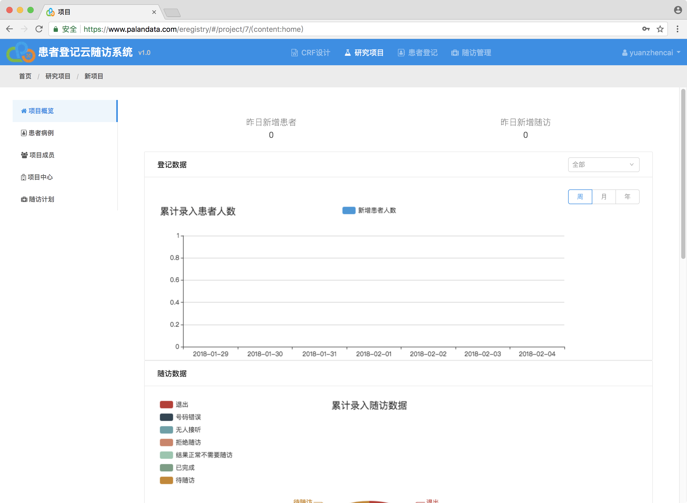

## 多中心管理

多中心管理允许项目管理员为项目创建和管理多个分中心，并且随时更新各中心的信息。各个中心的成员组成、工作进度，这些数据都会实时的显示出来，管理者可以根据具体情况进行调整

* 创建分中心

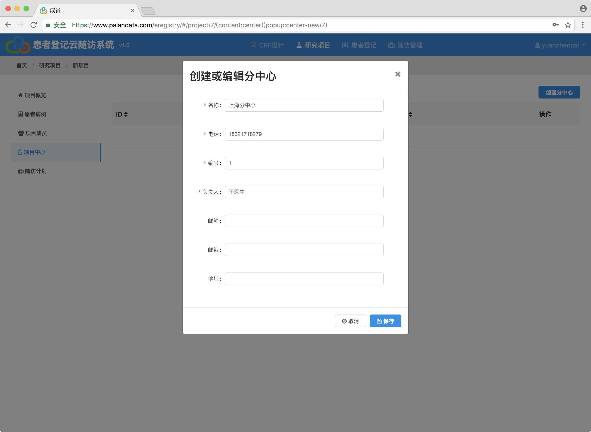

* 分中心列表

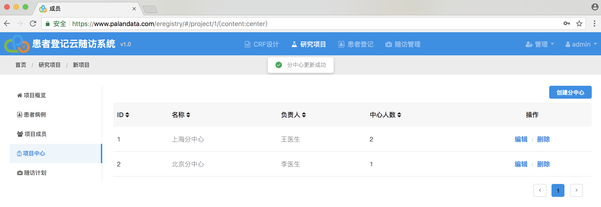

## 统一的以患者为中心的临床数据视图

患者的初次登记信息、后期的随访记录以及各类支持性证据文件，都会统一地展示出来，形成一个以患者为中心的临床数据视图，支持项目参与者开展统计分析，推动研究工作的进展

## 随访计划的制定及随访管理

为项目的随访工作制定执行规则，添加随访组成员。系统会自动筛选出符合随访规则的患者清单，并分配给相应的随访成员。每一次的随访记录都会更新到统一的临床数据视图中，并且，随访工作进展的数字也会实时地展示出来

* 创建随访计划

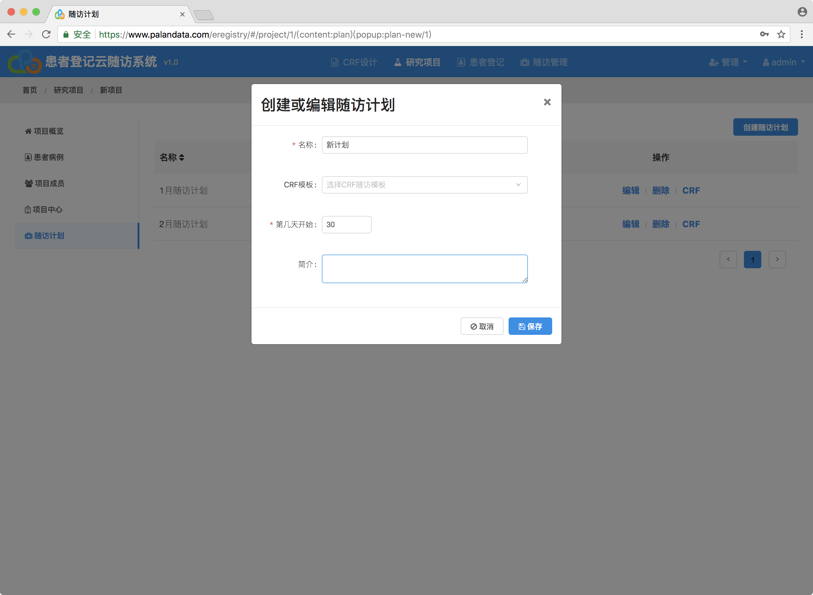

* 编辑随访CRF

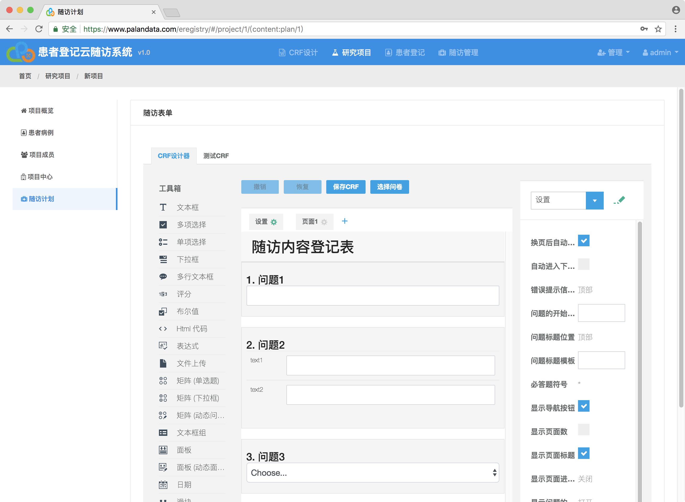

* 选择CRF

当随访计划使用相同的CRF时候，我们可以通过选择你之前创建过的CRF

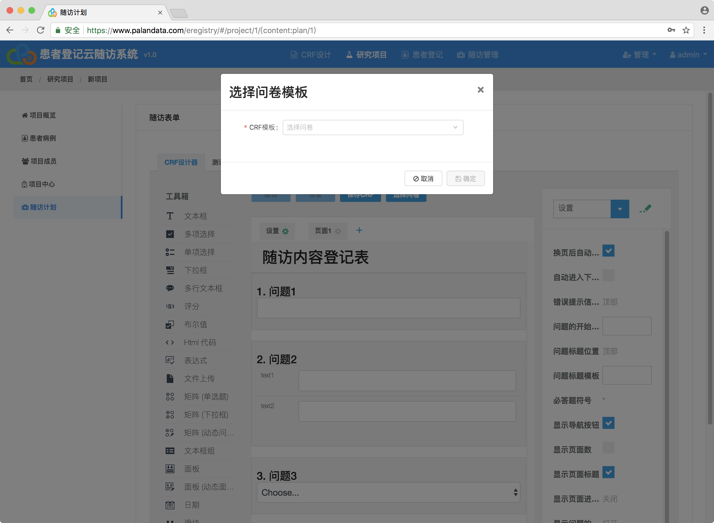

## 项目成员的管理

* 添加成员

我们可以通过用户名搜索来添加成员

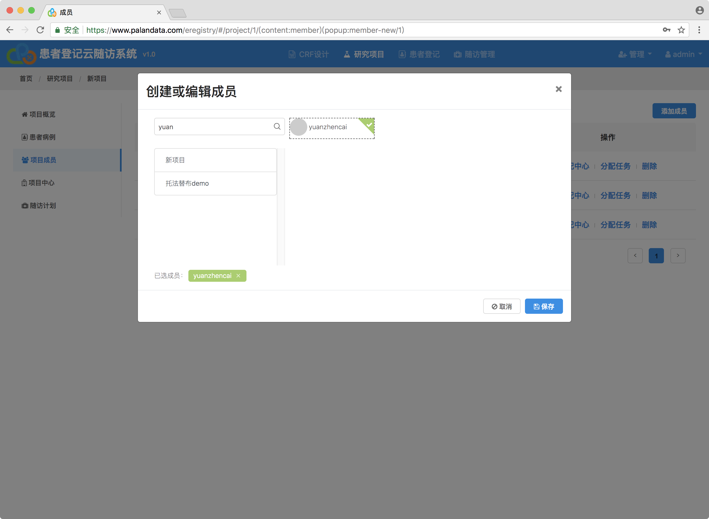

如果用户不存在，只需要一个邮件就可以邀请到系统里，然后等用户激活后自动就加入到项目中

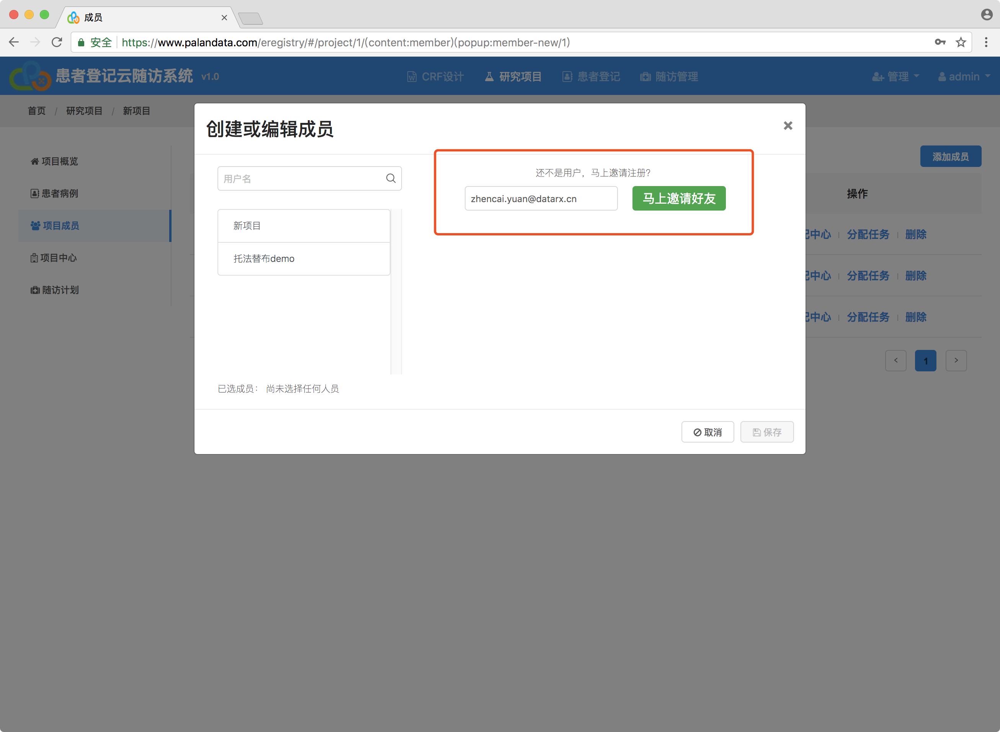

还可以添加你参加的其他项目的成员

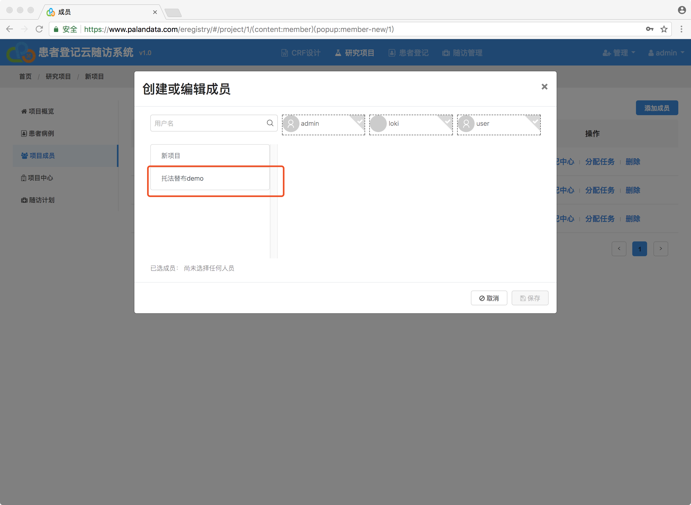

* 成员列表

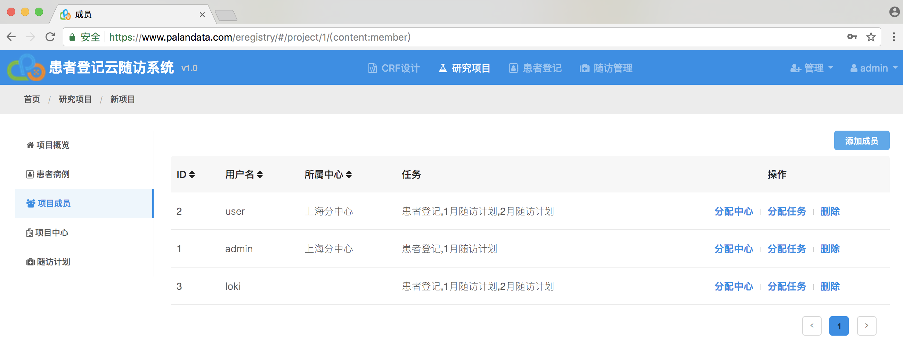

* 分配中心

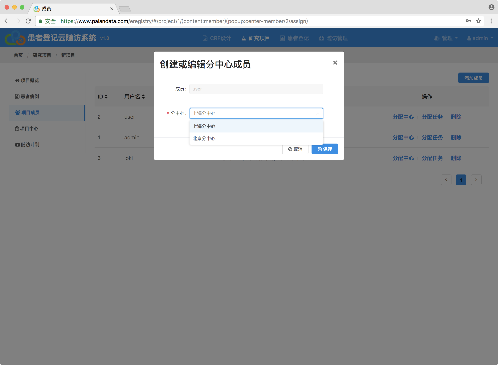

* 分配任务

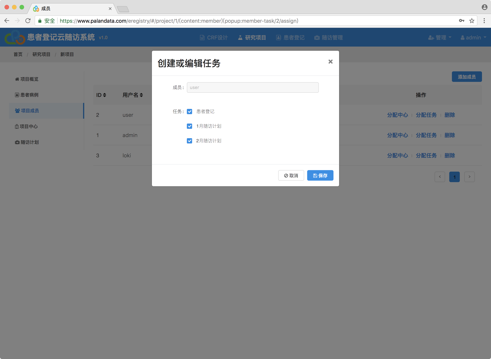

