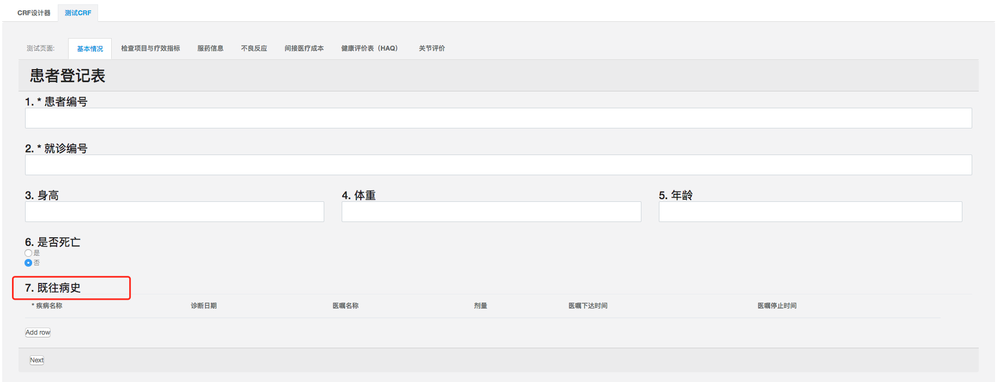

## 问题的通用选项设置

* 题目名，标题名

当有时候题目名太长的时候，我们就可以把题目名写到标题名里，然后把题目名换成一个简短的名称，这样可以在录入人录入的时候还是看见详细的问题描述，内容所对应的值则是简短的题目名。


* 是否必答

我们可以通过设置必答来强制录入人一定要回答问题，题目前面会有必答符号来表示是否是必答题，如果用户没有填入信息，会有错误信息显示，也可以单独设置错误信息


* 是否新起一行

当我们想把两个问题放在一行的时候，我们就可以设置不新起一行，然后就可以在一行里显示两个问题，或者是多个问题。


* 设置可见条件

当问题依赖某个问题的回答答案时候，我们就可以设置条件来控制题目的显示。

当条件判断为真时问题/页面将可见。例如: {问题1} = "值1" or ({问题2} * {问题4} > 20 and {问题3} < 5)

比如，是否死亡，死亡原因。只有死亡的情况才需要填写死亡原因。我们就可以设置死亡原因的可见条件。

```
{是否死亡} = "是"
```


是否死亡是的时候


是否死亡否的时候


