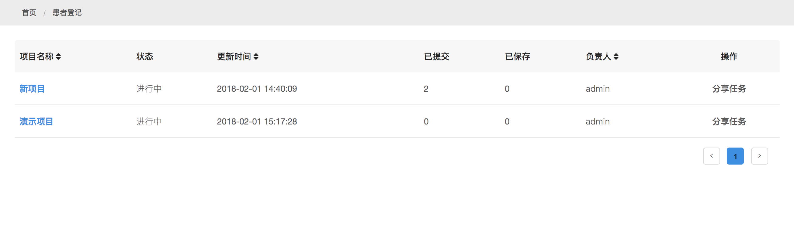
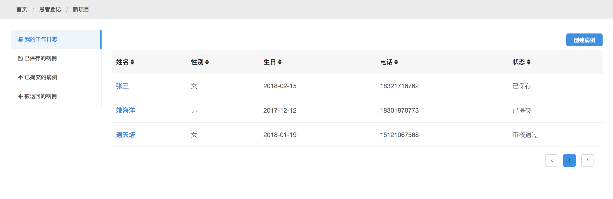
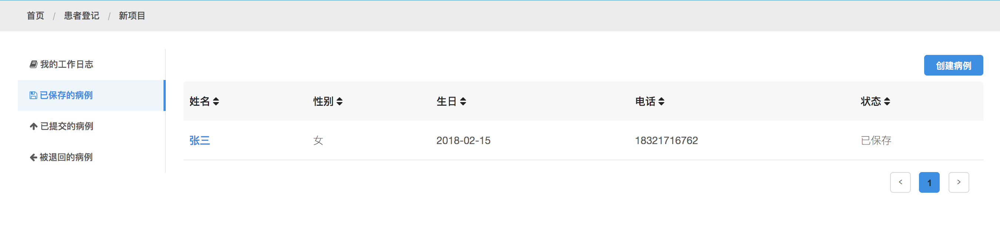
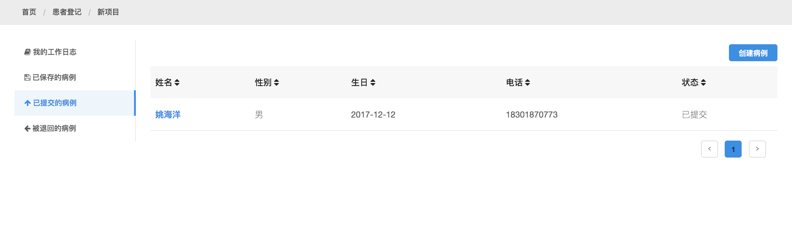
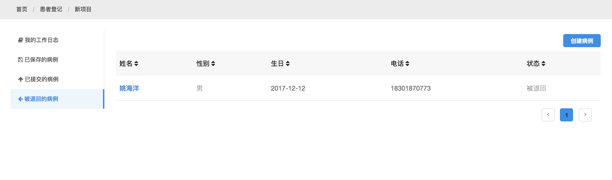
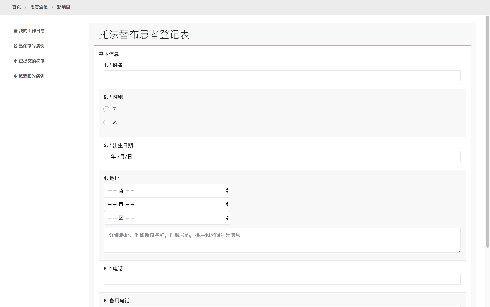
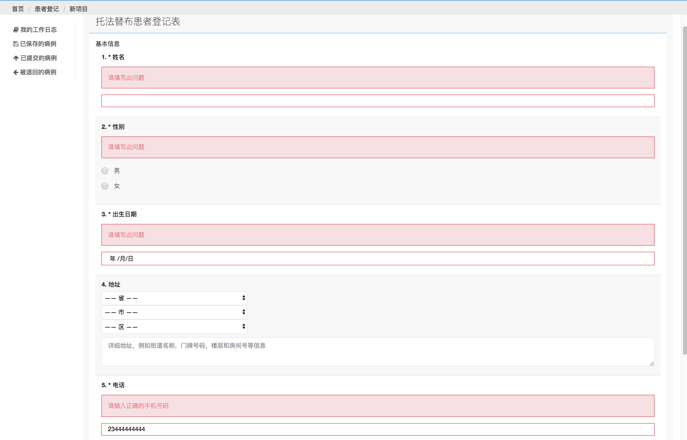
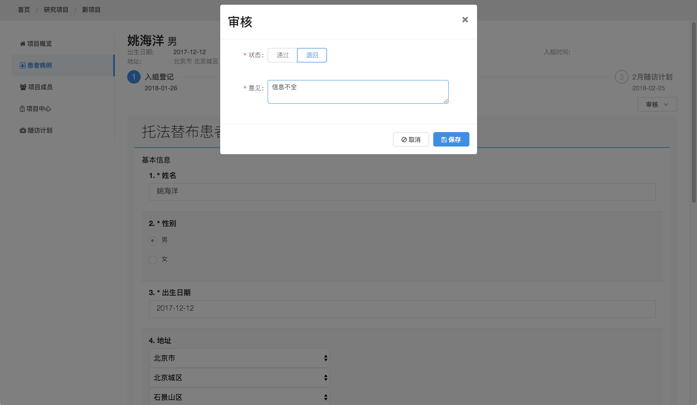
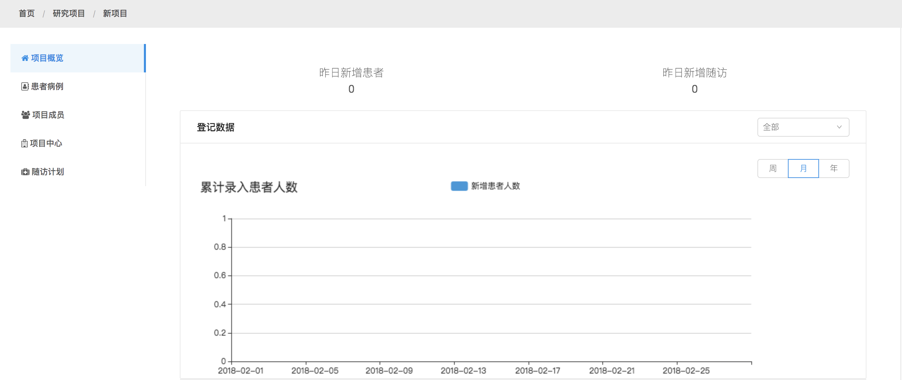

# 轻松地为不同的项目分配不同的、有针对性的患者登记应用

通过加载已经定制好并发布的病例表表单，您就可以快速地为不同的研究项目部署不同的，并且是有针对性的患者登记应用，即使同时开展多个项目，也都轻而易举

* 我的工作日志

我所有做过操作的记录都会在这边显示，方便事后查阅

* 已保存的病例

方便登记人查找临时保存的记录，然后重新编辑提交。

* 已提交的病例

方便登记人查找已经提交审核的记录。

* 被退回的病例

方便登记人查找被退回的记录，然后重新编辑提交。

## 内置的患者基本信息模块，轻松调用

患者登记应用内置了通用的患者基本信息模块，包括姓名、性别、出生日期、联系电话、备用电话、居住地址等等

## 数据的质量控制及审查

应用系统会基于一定的规则对录入的数据进行判断并给予输入者提示，要求检查所录入数据项的正确性。

同时，应用系统也设置了人工审查的选项，即数据录入者提供的登记信息必须经过一位有资格的管理员进行最后的审查批准才能正式生效

## 实时的工作进度汇总数据

无论是新增加的患者数据还是已提交待审核的患者数据都会实时的进行数据的汇总并通过图表等形式反应出来，让录入人员以及项目的管理员能够及时把控工作进度

