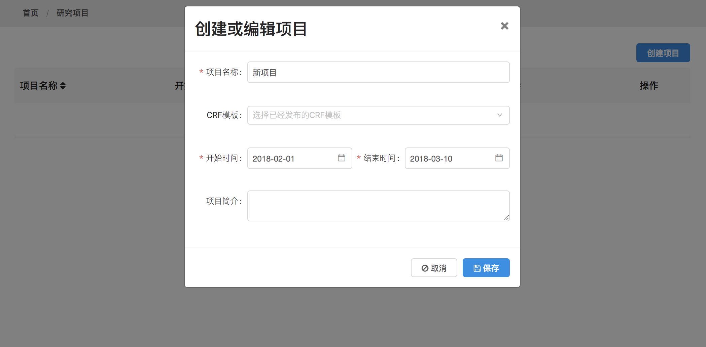

## 轻松创建一个新的研究项目

创建一个新的研究项目仅需要几个简单的步骤，比如：为项目起一个有特点的名字、选择并加载一个定制好的病例表、添加项目组的成员并为其分配患者登记或随访等任务...然后，您就可以马上启动这个项目了

同时管理多个项目，让项目管理变成一件简单的事情。

可以让项目管理员轻松的看到项目的情况

* [项目概览](project/summary.md)
* [患者病例](project/patient-list.md)
* [项目成员](project/member.md)
* [项目中心](project/center.md)
* [随访计划](project/plan.md)

