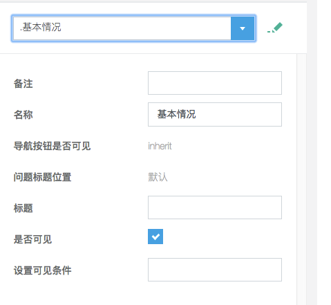
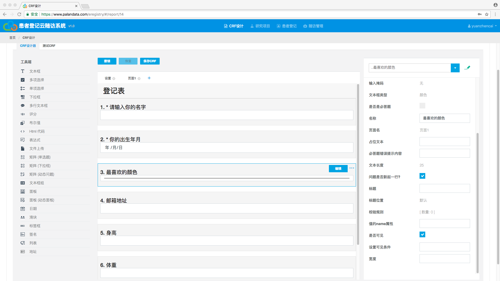
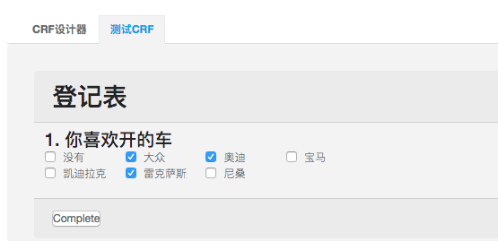
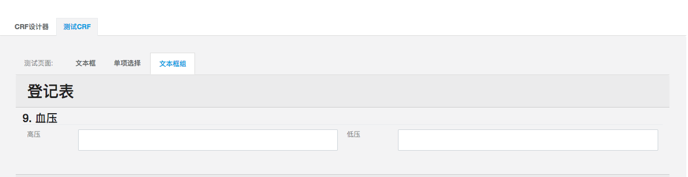
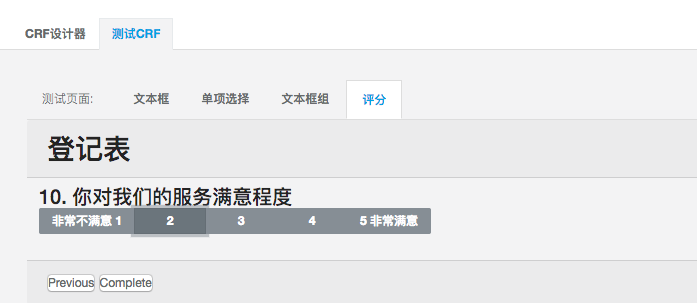
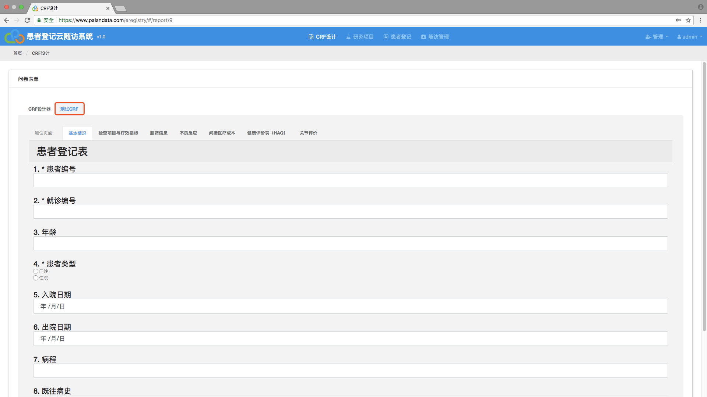

## 按需定制病例表的数据项

研究目的与研究方法的不同，需要关注的临床数据项自然也不同，使用CRF设计工具可以让您按照实际需要，自行定义数据项，然后快速生成满足自己需要的电子数据捕获应用（EDC）

* 基本设置


* 导航设置

有时候我们可能会不想要导航按钮，而是希望填完信息后直接进入下一页，那我们就可以通过导航标签页来设置，还有当一个CRF表有很多页面的时候，我们可以显示进度条，让录入人知道当前填写的进度


* 问题设置

在这个标签页面我们可以设置问题的基本属性，比如标题显示的位置、必答题的符号、是否显示问题的数目等等。


## 自定义页面标题和添加说明

为您的病例表添加页面标题以及相关的说明，可以使CRF的结构更加清晰，让一切看起来整齐有序。添加页面标题及说明不但让自己的思路更加清晰，同时也方便了表单的使用者，提高了数据捕获时的效率，降低了出现差错的可能性



## 丰富多样的问题类型

CRF设计工具提供了多种多样的问题类型来满足收集数据的需要，比如：文本框、多想选择、单项选择、下拉框、多行文本框、日期、表格、地址等...同时，也支持上传多媒体附件（图片、视频、音频等）。


### 问题的通用选项设置

* 题目名，标题名

当有时候题目名太长的时候，我们就可以把题目名写到标题名里，然后把题目名换成一个简短的名称，这样可以在录入人录入的时候还是看见详细的问题描述，内容所对应的值则是简短的题目名。


* 是否必答

我们可以通过设置必答来强制录入人一定要回答问题，题目前面会有必答符号来表示是否是必答题，如果用户没有填入信息，会有错误信息显示，也可以单独设置错误信息


* 是否新起一行

当我们想把两个问题放在一行的时候，我们就可以设置不新起一行，然后就可以在一行里显示两个问题，或者是多个问题。


* 设置可见条件

当问题依赖某个问题的回答答案时候，我们就可以设置条件来控制题目的显示。

当条件判断为真时问题/页面将可见。例如: {问题1} = "值1" or ({问题2} * {问题4} > 20 and {问题3} < 5)

比如，是否死亡，死亡原因。只有死亡的情况才需要填写死亡原因。我们就可以设置死亡原因的可见条件。

```
{是否死亡} = "是"
```


是否死亡是的时候


是否死亡否的时候


### 问题类型

* 文本框

文本框是使用频率最高的问题类型，输入文本信息。



还可以支持各种输入类型，例如文本、日期、数值等等


* 单项选择

当问题的答案是几个选项中的一个的时候，我们就可以选择单项选择这类问题。

然后我们要设置选项


还可以设置选项的列数


* 下拉框

我们也可以把单项选择通过下拉框的形式展现


通过快速输入添加选项


还可以通过请求导入选项


* 多项选择



* 布尔值

当答案只有真或者假的时候，我们就可以用


* 矩阵-单选

当问题有行和列的时候我们就可以用矩阵来展示。

当列的选项是单选的时候


* 矩阵-下拉

当列的选项是多选的时候


* 矩阵-动态

当行的个数不定的时候


* 文本框组

当一个问题涉及到好几个指标的时候可以使用



* 评分

可以对某种问题做成评价



* 多行文本框

当问题的文本比较多的时候，我们就可以设置多行文本框


## 所见即所得的编辑方式

通过添加图片等多媒体格式文件，或展示网站链接，您的病例表看起来会更加生动直观，同时，您可以使用预览功能，随时查看设计的效果，并及时做出调整和优化，CRF设计工具是真正的所见即所得的编辑器



