## 按需定制病例表的数据项

研究目的与研究方法的不同，需要关注的临床数据项自然也不同，使用CRF设计工具可以让您按照实际需要，自行定义数据项，然后快速生成满足自己需要的电子数据捕获应用（EDC）

* 基本设置


* 导航设置

有时候我们可能会不想要导航按钮，而是希望填完信息后直接进入下一页，那我们就可以通过导航标签页来设置，还有当一个CRF表有很多页面的时候，我们可以显示进度条，让录入人知道当前填写的进度


* 问题设置

在这个标签页面我们可以设置问题的基本属性，比如标题显示的位置、必答题的符号、是否显示问题的数目等等。


## 自定义页面标题和添加说明

为您的病例表添加页面标题以及相关的说明，可以使CRF的结构更加清晰，让一切看起来整齐有序。添加页面标题及说明不但让自己的思路更加清晰，同时也方便了表单的使用者，提高了数据捕获时的效率，降低了出现差错的可能性


## 丰富多样的问题类型

CRF设计工具提供了多种多样的问题类型来满足收集数据的需要，比如：文本框、多想选择、单项选择、下拉框、多行文本框、日期、表格、地址等...同时，也支持上传多媒体附件（图片、视频、音频等）。

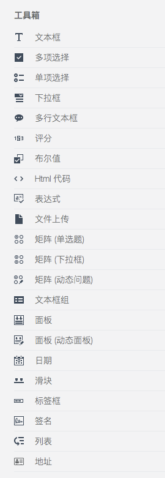

### 问题的通用选项设置

* 题目名，标题名

当有时候题目名太长的时候，我们就可以把题目名写到标题名里，然后把题目名换成一个简短的名称，这样可以在录入人录入的时候还是看见详细的问题描述，内容所对应的值则是简短的题目名。


* 是否必答

我们可以通过设置必答来强制录入人一定要回答问题，题目前面会有必答符号来表示是否是必答题，如果用户没有填入信息，会有错误信息显示，也可以单独设置错误信息


* 是否新起一行

当我们想把两个问题放在一行的时候，我们就可以设置不新起一行，然后就可以在一行里显示两个问题，或者是多个问题。

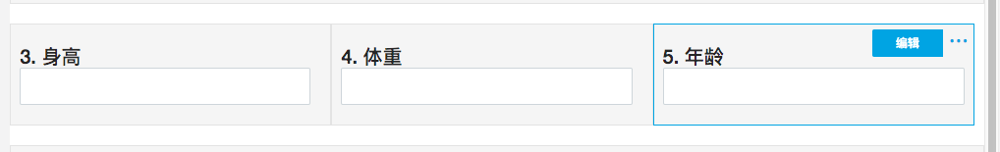

* 设置可见条件

当问题依赖某个问题的回答答案时候，我们就可以设置条件来控制题目的显示。

当条件判断为真时问题/页面将可见。例如: {问题1} = "值1" or ({问题2} * {问题4} > 20 and {问题3} < 5)

比如，是否死亡，死亡原因。只有死亡的情况才需要填写死亡原因。我们就可以设置死亡原因的可见条件。

```
{是否死亡} = "是"
```


是否死亡是的时候

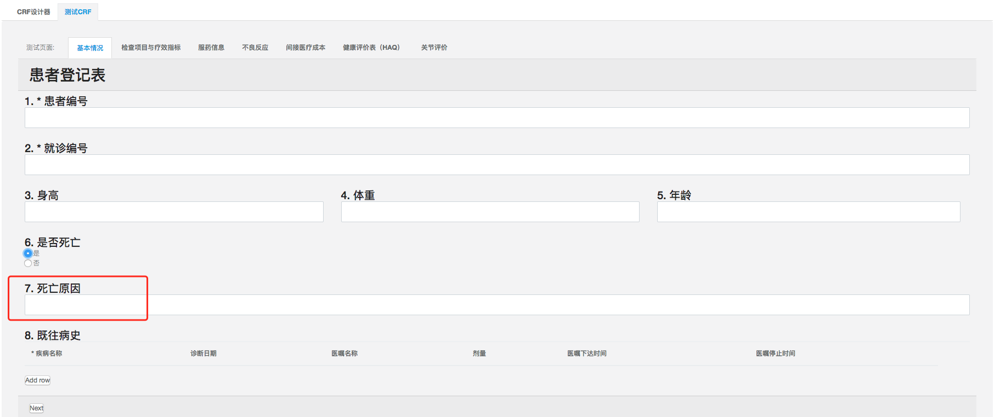

是否死亡否的时候


### 问题类型

* 文本框

文本框是使用频率最高的问题类型，输入文本信息。


还可以支持各种输入类型，例如文本、日期、数值等等


* 单项选择

当问题的答案是几个选项中的一个的时候，我们就可以选择单项选择这类问题。

然后我们要设置选项


还可以设置选项的列数

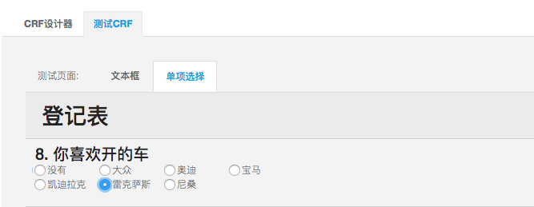

* 下拉框

我们也可以把单项选择通过下拉框的形式展现

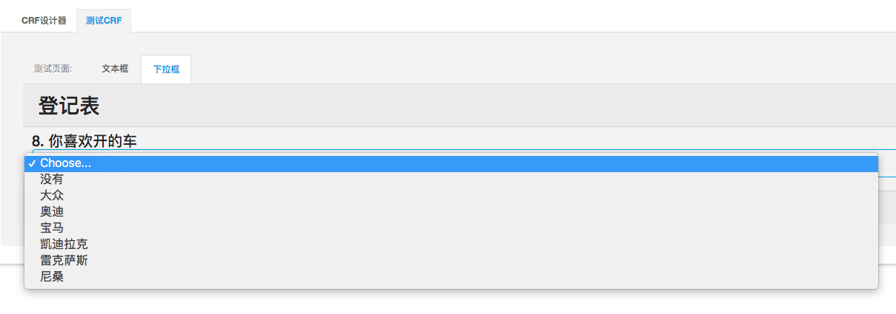

通过快速输入添加选项


还可以通过请求导入选项

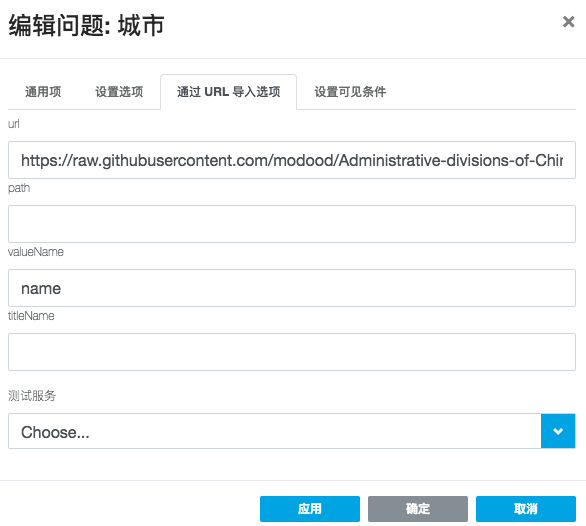

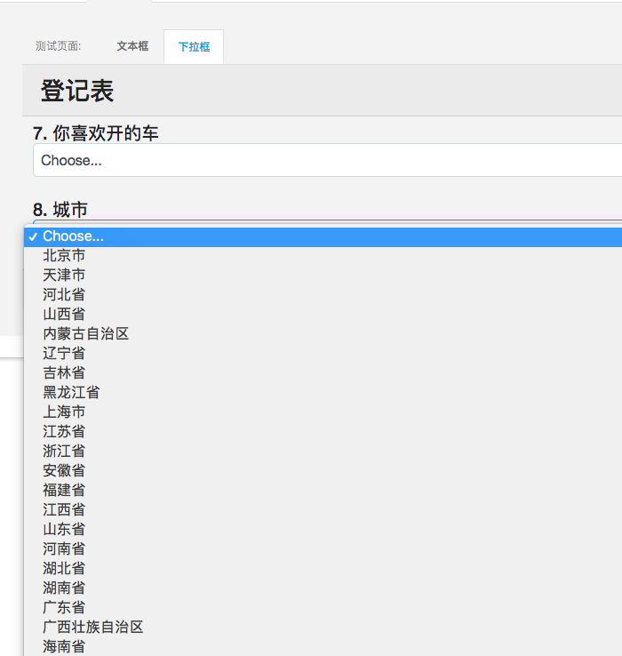

* 多项选择


* 布尔值

当答案只有真或者假的时候，我们就可以用


* 矩阵-单选

当问题有行和列的时候我们就可以用矩阵来展示。

当列的选项是单选的时候

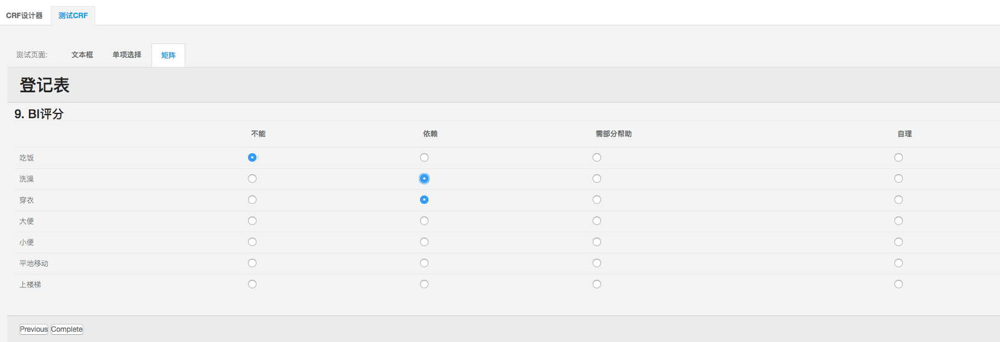

* 矩阵-下拉

当列的选项是多选的时候


* 矩阵-动态

当行的个数不定的时候


* 文本框组

当一个问题涉及到好几个指标的时候可以使用


* 评分

可以对某种问题做成评价


* 多行文本框

当问题的文本比较多的时候，我们就可以设置多行文本框


* HTML

我们可以添加互联网上的图片、视频。这样就让CRF更加生动，直观

我们先要填写HTML代码


效果

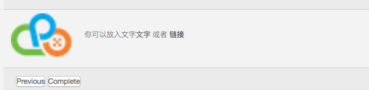

* 文件


* 复杂问题（文本框 + 文件 + 动态面板 + 表达式）

比如有个复杂的问题叫，请添加你购买的药物

这个问题中涉及到动态情况，因为你可以能有买过药物，也有可能没有。

要添加药品图片、单价、数量，但是还要总价，也就是单价 * 数量，所以就要用到 文本框 、 文件 、 动态面板 、 表达式等组件。

接下来我们就来设计一下这个问题。

1. 首先是动态，然后因为为了好看我们还想稍微要排版下问题，所以我们选择"动态面板"空间

    设置面板的基本属性，比如添加面板的按钮名称和删除面板的按钮名称
    
    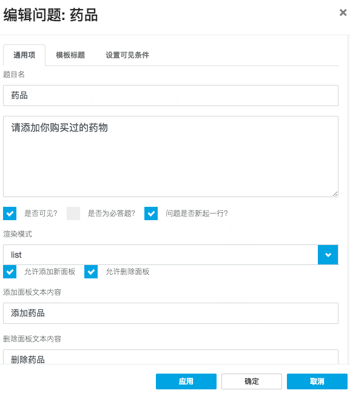
    
    有时候我们想要知道到底添加了多少个商品的时候，就可以设置一个面板名称，比如 药品 1、药品 2，那我们就可以用到动态面板里内置的参数*panelIndex*，然后通过`#{panelIndex}`调用。
    
    所以我们就可以这样设置面板标题
    
    ```
    药品 #{panelIndex}
    ```
    
    

2. 添加药品问题，然后通过是否新起一行来控制页面布局
    
    
    
3. 最关键的是计算，因为我们要为每填加一条数据就要计算总价，所以我们要用到表达式组件，由于我们是动态面板，所以我们要用到内置的例外一个参数*panel*,然后通过`panel.问题`来得到每条记录里问题的值

    所以要设置总价的表达式的值为
    
    ```
    {panel.单价}*{panel.数量}
    ```
    
    
    
    有时候我们还需要单位，我们就可以设置显示样式和货币类型
    
    

4. 有时候我们可能还要对问题里做个汇总，比如求和，求平均，就像药品的总数、总价、均价

    那我们就要用到表达式里非常有用的内置函数*sumInArray({问题},'属性')*。
    
    然后我们这次就要算下所有药品的总价和药品的总数
    
    先利用面板组件添加三个表达式组件，分别是总数，总价，均价
    
    
    
    然后要设置总数的表达式
    
    ```
    sumInArray({药品}, '数量')
    ```
    
    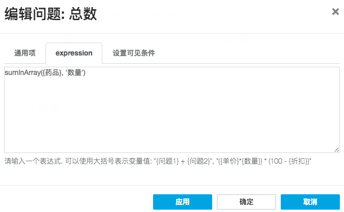

    总价也是类似
    
    ```
    sumInArray({药品}, '总价')
    ```

    
    
    最后是均价，这个就比较简单，就是问题总价的值除以问题总数的值
    
    ```
    {总价}/{总数}
    ```
    
    


最后的效果


## 所见即所得的编辑方式

您可以使用预览功能，随时查看设计的效果，并及时做出调整和优化，CRF设计工具是真正的所见即所得的编辑器


